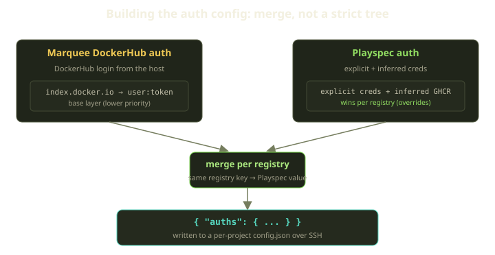
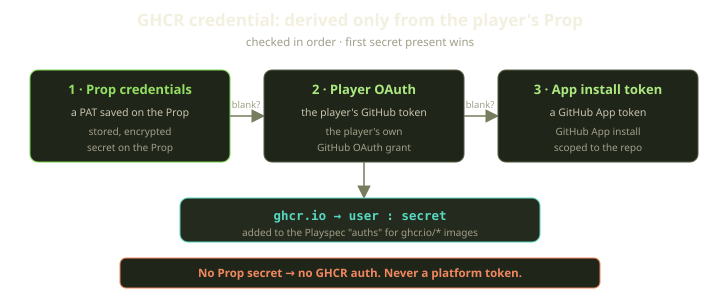
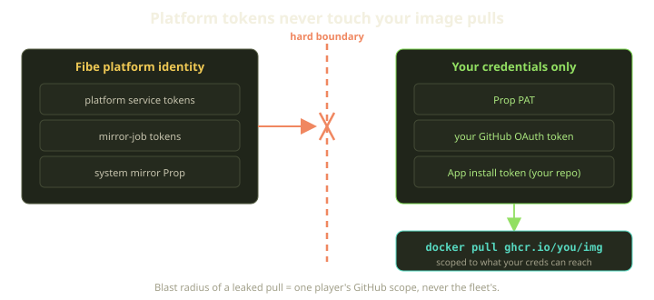

Every time Fibe brings up a Playground, provisioning has to answer a small, unglamorous question: which credentials do we hand the Docker daemon so it can pull your private images? It's plumbing — but the wrong answer is the kind of thing that turns into a security incident with a postmortem and a regretful blog post.

So here is the one rule we refuse to bend: when we pull an image from GitHub Container Registry, we authenticate with *your* credentials and only your credentials. Fibe's own platform tokens never touch your pulls — not as a convenience fallback, not for a system mirror, not "just this once" to unblock a build. This post walks through how the credential merge works and what we get out of keeping our tokens on the other side of a wall.

<!-- truncate -->

## Where this happens in the lifecycle

Bringing up a Playground is an ordered pipeline of eight local steps. Registry auth is the third step, wedged between cloning your source and building the image. Earlier steps stand up the reverse proxy and pull down your branch; later steps build the image, generate the Compose project, start the agent, and bring everything up. Registry auth sits right in the middle, because everything downstream of it needs the daemon to already be logged in.

That auth step does one job: it figures out the full set of registry credentials this environment needs, assembles them into a Docker `config.json`, and writes that file onto the Marquee — the player-owned Docker host — over SSH. By the time the image build and the Compose bring-up run, the daemon already knows how to authenticate to every registry involved.

One detail matters for the rest of this post: we do **not** write the host's global Docker config. The config lands in a per-project directory that build and Compose point Docker at via its config-directory environment variable, so one Playground's credentials never bleed into another's.

:::note
A Marquee is the player's Docker host — a bring-your-own SSH box or an auto-provisioned Scaleway VM. Several Playgrounds can share one, which is precisely why per-project credential isolation isn't optional.
:::

## Two sources, one merge

Credentials come from two places, and the final `config.json` is a merge of both.

The **Marquee** contributes a DockerHub credential, if the owner has configured one. It's a single entry, keyed by the DockerHub registry endpoint and built from the host-level username and token the Marquee owner set up. If the Marquee has no DockerHub login configured, it contributes nothing — an empty set of credentials rather than a placeholder.

The **Playspec** contributes everything else: any explicit registry credentials you've added, plus credentials we *infer* automatically for GHCR images (more on that in a moment). Each is keyed by its registry URL.

Then we merge the two sets into one. The operation is a plain per-key merge of the registry maps, with the Playspec's entries applied on top of the Marquee's. There's no priority tree, no first-source-wins branching, no special casing — just two maps of `registry → credential` combined into one.

That single merge is the whole precedence model. It's a per-key merge with the Playspec taking the high ground, so for any given registry, **if both the Marquee and the Playspec have a credential, the Playspec's wins.** Registries only one side knows about pass straight through into the result.

### Why a merge and not a strict tree

We documented this internally as "precedence" for a long time, and that framing was subtly wrong. "Precedence" makes you picture a strict first-match tree — check source A, use it if it has anything, otherwise fall back to B — which would mean "if the Marquee has *any* DockerHub creds, ignore the Playspec entirely," or the reverse. Both are bad: the Marquee's DockerHub login and a Playspec's GHCR credential aren't competing, they're for different registries, and the environment needs both at once. A tree forces a global winner when the real answer is per-registry.

The merge gets you the union by default and a clean override exactly where keys collide. The mental model is `git config`: the more specific scope (the Playspec) shadows the broader one (the Marquee) for the same key, and everything else is additive.

## GHCR: derived from your Prop, full stop

GHCR is where the security story gets sharp, because GHCR credentials are never something you type into a Playspec by hand — we derive them. When a Playspec references a `ghcr.io/...` image, we mint a credential from the service's source **Prop**, your player-owned Git binding. The Prop is the same object that authorizes cloning your repository, so reusing it is the least-surprising choice: if you can clone it, you can pull its packages.

The derivation walks a short list of candidate secrets and takes the first one that's actually present, trying them strictly in this order:

1. **The Prop's stored credentials** — a personal access token you saved on the Prop.
2. **The owning player's GitHub OAuth token** — your own OAuth grant.
3. **The GitHub App installation token** — scoped to the specific repository.

Each candidate is checked for a non-empty value; the first that has one becomes the GHCR secret, and the rest are never consulted. Nothing about this is clever — it's a fixed, three-deep fallback over secrets that all belong to you.

Notice what all three have in common: they are *yours*. There is no fourth branch — if none yields a secret, we produce no GHCR credential, and the pull fails with a clean auth error rather than silently succeeding under another identity.

That installation token is short-lived on purpose. The App mints it from an RS256-signed JWT with a 10-minute expiry, then caches the token for 50 minutes — long enough to be useful across a build, short enough that a leaked one ages out fast.

## The rule: platform tokens stay out

Here's the line we won't cross: **GHCR images are never pulled with a platform token or a mirror-job token** — only the player's own credentials, derived as above.

Fibe has plenty of its own GitHub identity — service tokens, mirror-job tokens, a system mirror Prop — and any could be wired in as a "fallback" so a pull never fails for want of a credential. We deliberately don't: the GHCR path has exactly one source, the player's Prop, with no branch that reaches for a platform identity.

Why hold it so firmly? Three reasons, in order of how much they keep us up at night.

**Blast radius.** If a platform token pulled images into player environments, a leaked `config.json` on one Marquee would be holding a credential scoped to *the platform's* access, not one player's. Keep it player-scoped and the worst case is one player's GitHub scope: a bad day for one account, not a fleet-wide event.

**Least privilege, made literal.** The credential that does the work has exactly the access the work requires and no more: the player's token reaches the player's packages, and that's the whole job. No ambient platform authority sits in the environment waiting to be misused.

**You can only access what your own creds allow.** A Playground can never pull an image its owner couldn't pull themselves: if you can't `docker pull` it from your laptop with your token, Fibe can't pull it for you either. A failed pull is then a real permissions answer about *your* access, never an artifact of some platform token quietly having more reach.

| Scenario | Credential used | Worst case if leaked |
|---|---|---|
| Pull `ghcr.io/you/api` | Your Prop PAT / OAuth / App token | One player's GitHub scope |
| Pull a private DockerHub base image | Marquee owner's DockerHub login | One Marquee's DockerHub access |
| Pull `ghcr.io/you/api` (platform fallback) | **never happens** | — |

That bottom row is the point of the whole post. It's a row that can't exist.

## Getting credentials onto the host, safely

Assembling the right `config.json` is only half the job; it has to reach the Marquee without leaking. We sync it over the same SSH connection we use for everything else, into the per-project config directory on the host. The flow is short: build the merged credential set, make sure the per-project directory exists on the host, then write the `config.json` into it — escalating with `sudo` only when that particular host requires it.

Two choices worth calling out:

- **Everything is shell-escaped.** Both the JSON payload and the target path are escaped for the shell before they touch a remote command. Registry URLs and tokens are attacker-influenced strings; they don't get to break out of the command and run something else.
- **No echoing to logs.** The write streams the escaped payload directly into the file rather than echoing it through any intermediate command — secrets don't get splattered across stdout or our logs on the way in.

When a Playground is torn down, the per-project directory goes with it — cleanup is just `rm`, with no shared file to prune one entry out of.

:::warning
This is also why "just add a platform fallback so pulls never fail" is the wrong instinct: a platform credential written into a `config.json` on a player-owned host is a platform credential sitting on hardware we don't fully control. The merge model means only owner-scoped secrets ever land there.
:::

## What we learned

- **Name the mechanic correctly.** Calling this "precedence" cost us real clarity. It's a per-registry merge where the more specific layer overrides, and once we said that out loud the override behavior stopped surprising people. The words in your design docs are part of the system.
- **A union with targeted overrides beats a priority tree** when sources are complementary rather than competing — the Marquee's DockerHub login and a Playspec's GHCR credential are for different registries, so forcing a single winner would have been a worse model.
- **Derive credentials from the object that already grants access.** GHCR auth reuses the Prop because the Prop is already your authorization to that repository — same identity, same scope, no new trust to reason about.
- **The most valuable rule is the one with no exceptions.** "Platform tokens never pull your images" is easy to state, easy to audit, and it bounds a leaked pull credential to one player's scope instead of the fleet's. A fallback would have been more convenient and strictly worse. We left it out, and the system is simpler *and* safer for it.

The least privilege you can reason about is the kind that physically can't be exceeded: when the only credential in your environment is one you could have used yourself, there's nothing extra to lock down — and nothing extra to lose.
