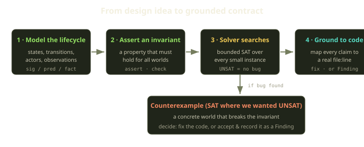
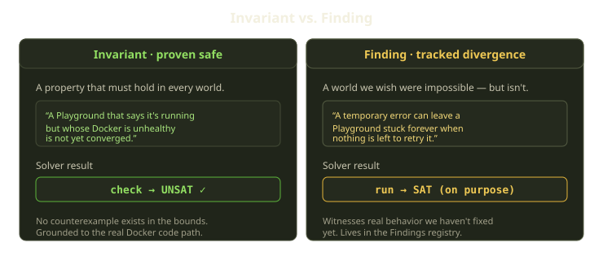

Most of our nastiest bugs were never typos. They were a state machine that looked right in the PR, passed its tests, and then met a customer doing something perfectly reasonable that nobody had drawn on the whiteboard. A Playground stuck in an error state forever. A chat that vanished because a healthcheck flapped. A runtime launched on a Marquee that hadn't been funded.

So we started writing down the hard lifecycles in [Alloy](https://alloytools.org/), a relational modeling language, and letting a solver do the part humans are worst at: trying every small, weird combination of states and asking "does your invariant actually hold here?" Often it doesn't — and the solver tells us exactly which world breaks it.

<!-- truncate -->

## What Alloy actually is

Alloy is a *relational model finder*. You describe a system as signatures (sets of atoms), relations between them, and constraints; then you ask the solver one of two questions:

- `run` — "find me an instance that satisfies these constraints." If one exists, the result is **SAT** and you get a concrete example.
- `check` — "find me a counterexample that *violates* this assertion." If none exists in the bounds, the result is **UNSAT** and your invariant holds.

`check` is the whole game. **UNSAT** is a small proof: within the scope you searched, no reachable state breaks your rule. **SAT** is a failing test the machine *wrote for you*, with the exact sequence of states that gets there.

The "bounded" part matters: Alloy proves your property only up to a finite scope (say, `for exactly 6 World, exactly 2 Playground`), not for all sizes. This is the [small scope hypothesis](https://alloytools.org/about.html) — most bugs have a witness in a tiny model. The edge cases that bite are never "what about 10,000 playgrounds"; they're "what about a playground whose Docker project went missing mid branch-clone, with no worker active." That fits in six worlds.

:::note
Alloy is a *design* aid, not the implementation. The model is a small, idealized contract; the real system is 100k+ lines of Rails, Rust, and Go. The value isn't that the model is true — it's that it's small enough to reason about completely.
:::

## Why we model state machines, not functions

Fibe is a control plane for Docker-based dev environments. A Player owns a Marquee (a Docker host) on which we deploy Playgrounds, Tricks, and AgentChats as Compose projects, route them with Traefik, and let a reconciler called Playguard heal everything on a 60-second loop. Almost every hard bug lives at the seam between *declared* state (what the database says is true) and *observed* state (what Docker, the filesystem, and the network actually report).

That seam is a state machine — exactly what Alloy is good at. A Playground alone moves through roughly ten declared states: it can be pending, mid-creation, running, in an error state, flagged as having pending changes, completed, stopping, stopped, being destroyed, or deleted. That list is just one axis.

Cross those states with "is Docker healthy / drifted / missing," "is the filesystem in sync," "is there an active creation job," "is the Marquee funded," "is this a background job-mode Trick" — and the reachable state space is enormous. You can't eyeball it, and testing by hand means writing the cross product and missing the same combinations your design did. A solver enumerates it free.

We model the lifecycles where the seam is sharpest:

| Lifecycle modeled | What it pins down |
|---|---|
| Playground lifecycle | status transitions, Docker observation, host-filesystem repair, stale-job recovery, Playguard safety |
| Playground convergence | the normative "what does *converged* even mean" contract |
| AgentChat recovery | reachable chats stay viewable during recovery; sustained failure queues an idempotent redeploy |
| Marquee runtime | Terraform/runtime status, the paid-runtime entitlement gate, quiesce-on-unavailable |
| Prop builds | Prop and build-record lifecycle, the billing gate for builds, drift detection |
| Tutorial billing | Wallet debit/ledger invariants, daily funding, grace, and the rule that never rewrites the paid-through time |

There are more, but those six are the ones whose bugs page someone.

## The workflow: model, assert, break, ground

The loop is the same four steps.

**1. Model the lifecycle.** We write the states, the actors (a user, the reconciler, an expiration sweep, a self-healing actor), the events between states, and the *observations* — Docker health, filesystem readiness, whether a job is queued or actively running. Most of the thinking happens here, because the model forces you to name things you'd been hand-waving. "What does it mean for a Playground to be *converged*?" turned out to be genuinely hard.

**2. Assert an invariant.** A safety property that must hold in *every* world. The strongest invariants are often built from negative assertions, which is more robust than trying to enumerate every good world. Convergence is a good example: rather than describe what "converged" looks like, we assert what it cannot be. For every world and every Playground, if the Playground reports itself as running but its observed Docker state is anything other than healthy, then it is, by definition, *not* converged yet. The database might say "running," but as long as the reconciler still has corrective work to do, the invariant refuses to call that state settled.

**3. Let the solver search.** We run the whole suite at once and read off SAT/UNSAT for every command. The Alloy command-line runner takes the model file, checks every assertion and runs every scenario in it, and emits a machine-readable result per command. The healthy outcome is boring — scenarios we *want* possible come back SAT, safety checks come back UNSAT — and boring is the goal.

**4. Ground it back to code.** The non-negotiable step. Every claim the model makes maps to a specific place in the real codebase — a file and line in the Rails monolith — and, where we have it, the test that covers that path. The convergence model's claim that "recovering Docker's true state clears a false error and returns a Playground to running" isn't just an Alloy assertion floating in the abstract; it points at the actual integration code that observes Docker and at the spec that exercises it.

## Counterexamples, and the decision they force

When the model and the code disagree, exactly one of three things is true, and naming which is the engineering work:

1. **The model is wrong.** We asserted something stronger than reality should be. Fix the assertion — humbling how often this is the answer.
2. **The code is wrong.** The counterexample is a real bug. Fix the code and watch the `check` flip to UNSAT.
3. **The code is knowingly wrong.** The counterexample is real, we understand it, and we've decided not to fix it *right now* — a **Finding**.

Findings are the part we're proudest of: the opposite of the failure mode where the model drifts from the code until nobody trusts it. When the solver shows us a divergence we're not fixing yet, we encode that exact bad scenario as its own named predicate, mark it clearly as a known-divergence Finding, and `run` it expecting **SAT**. A green Finding means "this bad world is still reachable, and we know." The naming convention matters here: a Finding is visibly distinct from an invariant, so nobody mistakes a deliberately-red scenario for a passing safety check.

Here's a real one. Our *perfect* contract says a temporary failure must always make progress toward a repair queue or back to running. The code doesn't, and the model captures precisely why. We describe the bad world directly: a Playground records a transient network failure mid-creation, then the system goes completely idle — no active worker, nothing queued — and from there it never reaches a converged state. Stated that plainly, the scenario is obviously broken; a Playground can sit in error forever simply because nothing is left running to push it forward.

That scenario comes back **SAT**, which is exactly the result that contradicts the ideal invariant we'd love to hold — the one saying every temporary error must reach a repair queue or get back to running. Because it's SAT, it lands in our Findings registry with a severity and a pointer to the real code that allows it. It's not a passing test pretending the bug doesn't exist — it's a *failing* test we keep red on purpose.

## A small worked example

Take convergence. The intuitive idea — "a Playground is converged when it's running" — is wrong, and the model makes you confront why. It splits into three:

- A **temporary** failure — a transient network blip, a Compose-up that can succeed on retry, an interrupted background job — is **not converged**. Keep retrying.
- An **irrecoverable** failure — a fatal Compose-up, a job that timed out for good, a spec that can never be satisfied — **is converged**. It's terminal and honest; there's nothing left to heal.
- A running status with drifted Docker, filesystem drift, or a lingering stale failure is **not converged**, whatever the user-facing state says — the database is lying and the reconciler still has work.

Modeling also surfaced a subtlety in the graph: a few of the reconciler's most important moves — promoting a falsely-errored environment back to running, quiescing a running chat when its Marquee goes unpaid — are corrective writes that live **outside** the normal, declared set of allowed transitions (the dashed edges in the diagram). The healing layer is intentionally permitted to make recovery writes the ordinary user-driven flow can't; you want that written down, not found at 2 a.m.

And one invariant we hold like a religion, from the Playguard model: **fail closed**. When rollout safety is ambiguous — a dirty workspace, an unknown host artifact, a Docker daemon we can't reach — Playguard does **not** reconcile destructively; it skips or quarantines and asks for help. The model encodes this as "an unknown host-artifact probe does not repair or recreate," and it checks UNSAT: no reachable world lets uncertainty cause deletion. That one property guards against a category of data-loss bug that is otherwise terrifyingly easy to introduce in a healing loop.

## What we learned

- **Model the seams, not the easy paths.** Alloy earns its keep where declared state and observed reality diverge — reconcilers, healing loops, billing gates. CRUD needs no model.
- **Defining the invariant is most of the value.** Half the bugs were fixed in the act of writing down what "converged," "viewable," or "funded" had to mean.
- **Track your divergences out loud.** A known bug with a machine-checked witness is a managed risk; an unknown one is an incident.
- **Ground everything, then re-ground it.** A model nobody maps back to code becomes fiction within a quarter; re-auditing the atlas found zero behavioral contradictions but plenty of drifted line numbers. That upkeep is the price.

We didn't adopt formal methods to prove the system correct, but to find design bugs cheaply — before code, before pages. The solver is a tireless, pedantic reviewer that has never once been polite about a hole in our reasoning. It doesn't care that the PR looks clean; it just builds the one world that breaks you and drops it on the desk.
