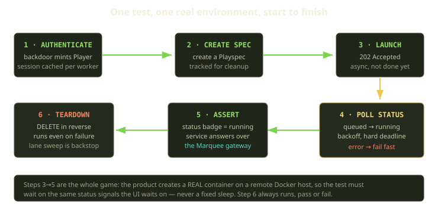
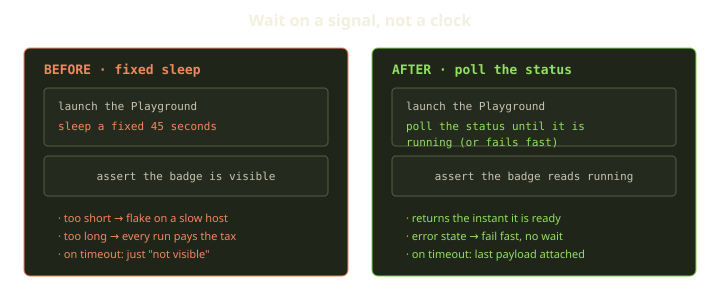
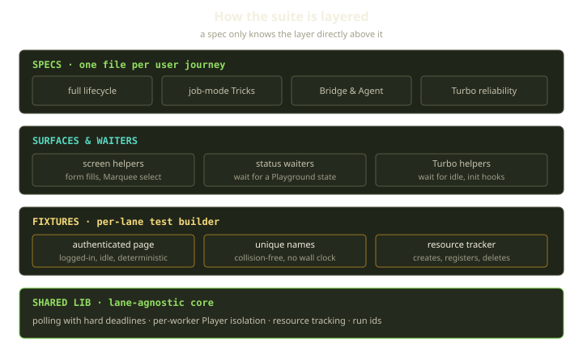

Most end-to-end suites test a stateless web app: click a button, the DOM changes, assert on the new DOM — all inside one browser tab. Our suite doesn't have that luxury. When a Fibe test clicks "Launch", a real Docker-Compose project starts spinning up on a real Marquee — a Docker host that might be a Scaleway VM in Paris or someone's laptop. The interesting state isn't in the page; it's a container, somewhere else, that doesn't exist yet and won't for the next forty seconds.

That single fact reshapes everything: the test is inherently async, the work is genuinely slow, and the thing you're asserting on is a remote process you don't control. Get the structure wrong and the suite goes red half the time for reasons nobody can explain, until everyone stops trusting it. This post covers the patterns that make browser tests against remote, stateful infrastructure boring and reliable.

<!-- truncate -->

## The one rule that kills the most flake: wait on a signal, never a clock

A fixed `sleep` is the single biggest source of flake in any suite that touches slow, variable work, and it fails both ways. Too short, and it flakes the first time a Marquee is under load. Long enough to be "safe", and every green run pays the tax — forty wasted seconds across a few hundred tests.

So we banned hand-rolled sleeps from spec code. Everything that waits goes through one shared polling primitive: it retries a check on a progressive backoff until it returns truthy, with a *hard deadline* — not an attempt count — and a diagnostic-rich error when it blows. Attempt counts lie; "give up after eight minutes" is a promise you can reason about. And because the primitive owns the loop, every wait gets the same backoff, timeout, and error shape for free.

Two choices matter here. First, the backoff schedules are named and shared: a snappy one for UI interactions, a status schedule (one second, then two, five, ten, fifteen) for state transitions, and a slow one for long provisioning. A test asks for the *kind* of wait it needs, not a magic number, so the cadence is tunable centrally. Second, the timeout error carries the last value and error it saw before giving up: "Playground 8412 never reached running within 480 seconds; last status seen was building" tells you what was happening, where "expected to be visible" tells you nothing.

On that primitive we build the waiters tests call. The workhorse polls the status API and lets the caller name which states count as success and which as terminal failure. That second list matters: when a Playground hits a terminal error state, we don't burn the deadline waiting for a "running" that's never coming — we fail *immediately*, with the response body attached so the failure is self-explaining.

A single classifier feeds all of this — one small function that collapses several shapes (a Playground's machine status, plus service-level inference for job-mode Tricks that run to completion and exit rather than staying up) into a verdict of running, completed, or error. Every waiter and assertion reads it, so "what counts as done?" lives in one place, and a long-running service and a short-lived job share the same code.

## Assert on instrumented state, not on pixels

Polling an API tells you the backend thinks the environment is up; this is a browser test, so we also assert the *UI* reflects it. The temptation is to match on text, but a status label couples the test to copy and translation — and we run a locale-switching suite, so an English string assertion is a guaranteed future failure. Instead, the status badge carries the raw machine state in a data attribute, and we assert on it with a web-first assertion that retries on its own — no visible text, no CSS class, no translation lookup. It's scoped too, targeting the whole page or a single Playground card so we can pin which one we mean. Because it keys off deliberate test hooks rather than visual structure, designers can restyle freely and the test doesn't notice: it's anchored to a contract, not a layout.

The same logic governs *when* we assert. Our app swaps DOM asynchronously through Turbo — Drive, Frames, Streams — which races naive assertions constantly. Rather than scatter sleeps to "let Turbo finish", we install a small init script that counts Turbo's own documented lifecycle events into a tally on the page; a single "wait for Turbo to be idle" helper then gives every test one settle barrier built on real framework events, not guesses about timing.

The strongest assertion proves the product actually *works*: we fetch the deployed service through the Marquee's Traefik gateway and check it answers. The check requests the service's own subdomain against the gateway host with the correct `Host` header and TLS server name — wildcard TLS per Marquee comes from ZeroSSL EAB plus acme-dns, so the SNI has to be exactly right or the handshake fails — follows redirects, and only passes on a non-error response that *also* matches a content signature the test supplies. That last condition is what makes it meaningful: a gateway returning its own default page is not your container answering. Passing means a container we launched is reachable over the routing a real user hits.

## Page surfaces, not page objects-for-the-sake-of-it

We use the page-object idea, but lightly. The classic mistake is a giant page-object class with a method for every conceivable interaction, most used once. We organize by *layer* instead, with one rule: a spec only knows the layer directly above it.

| Layer | What lives there | What it owns |
|---|---|---|
| Specs | one file per user journey | the narrative of one journey, top to bottom |
| Surfaces & waiters | screen-driving and waiting helpers | how to drive a screen and how to wait for it |
| Fixtures | a per-lane test builder | auth, naming, resource tracking |
| Shared lib | lane-agnostic core | polling, isolation, cleanup |

A spec reads like prose because the verbs live one layer down — "select this Marquee", "pick that Playspec", "wait for the Playground to be running." When the launch form gets a new field, one helper changes, not forty specs. And because a spec never reaches past surfaces into the shared lib, each layer can be reworked in isolation.

The fixtures layer is where Playwright earns its keep. The headline fixture hands the test a page that's already logged in, settled, and animation-free. Authentication goes through a test-only backdoor that mints a session server-side; we capture that state once and reuse it across the worker, paying the login round-trip once per worker instead of once per test — on a suite of hundreds of tests, that saves more wall-clock time than any other choice. The resource fixtures are the other half: creating a Playground through them *also* registers it for deletion in the same call, so it's structurally impossible to leak one.

## Isolation by player and Marquee, so workers don't trip over each other

Run a stateful suite in parallel and the obvious disaster is two workers fighting over the same resources. We solve it at the identity level: every worker mints its own Player and API key through the test backdoor, scoped to a lane — separate lanes for the API, UI, integration, Bazaar, Agent, and third-party suites — and a run id. Everything a worker creates is owned by *its* Player, so workers are invisible to each other; there's no shared namespace to coordinate, because there isn't one.

Marquees are shared and finite, so we spread workers across them deterministically by index, which keeps load even and pins a given test to the same host across retries. Resource names are derived, never random: each hashes together the project, file, title, worker, and the repeat and retry indices — no timestamp anywhere. Two tests can never collide, and each *retry* gets a fresh name on purpose: the previous attempt's container may still be tearing down, so reusing the name would be a self-inflicted race. And because the same inputs always produce the same name, a flaky run's leftover resource is easy to track down.

Cleanup is layered to match. The per-test tracker deletes a test's own resources in reverse order afterward — pass *or* fail — and reports any failure loudly, as a visible test annotation, never swallowing it. Behind it, a run-level sweep removes anything orphaned, matched by lane and run id, so even a worker that crashes mid-test can't leave debris for the next run.

:::note
Deleting a Playground isn't fire-and-forget — it kicks off a server-side destroy lifecycle. So the tracker's delete is itself a small waiter: it retries while the resource reports locked or in use (HTTP `409`/`423`) and polls until it answers `404`. "I sent the DELETE" and "it's gone" are different facts, and only the second is safe to build the next test on.
:::

## What we learned

The throughline is short. Replace every sleep with a signal, and fail fast on terminal states so red comes as quickly as green. Assert on instrumented state — machine-readable attributes and emitted events the production code already fires — not on copy that restyling and translations will break. Isolate at the identity layer with deterministic, retry-aware names, and make cleanup structural.

None of this is exotic Playwright. It's the ordinary primitives — fixtures, web-first assertions, init scripts — pointed at one goal: never let a test's outcome depend on how fast a remote Docker host felt today.
