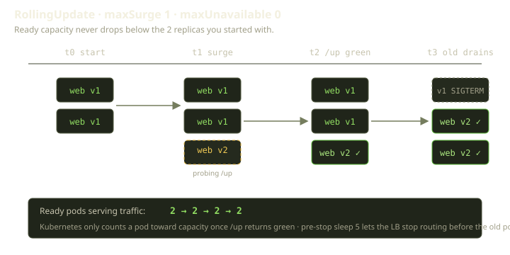
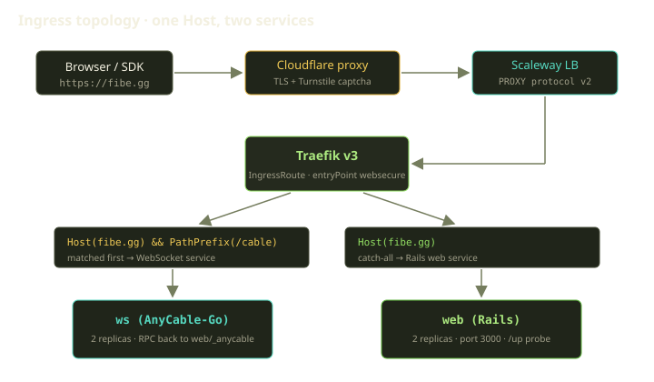
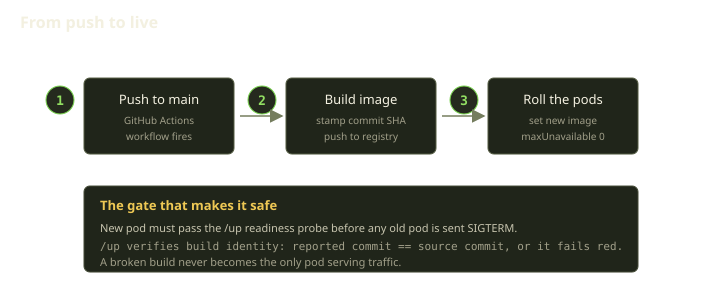

The Fibe control plane is the Rails app behind `fibe.gg` — it schedules your Playgrounds, talks to your Marquee, moves Mana around your wallet, and answers the SDK. It is the one genuinely centralized piece of Fibe: your environments run on your own Docker host, but the control plane runs on ours. So "drop a few requests, nobody will notice" is not a posture we get to take. A dropped request is a Genie that loses its socket, a `fibe` command that times out, a half-completed checkout.

The deploy strategy is boring on purpose: zero unavailable pods, a real health probe, and a load balancer that won't route to a pod until that probe is green. We push to `main` in the afternoon and watch capacity stay flat while a new version rolls in under the old one.

<!-- truncate -->

## Where it runs

The control plane lives on Scaleway Kubernetes, the whole cluster described in Terraform in our infrastructure repo. Two web replicas, two AnyCable WebSocket replicas, two PgBouncer replicas in front of the managed Postgres, and a worker. Cloudflare sits in front for DNS, TLS termination, and Turnstile captcha on the auth routes; a Scaleway load balancer behind it; Traefik v3 behind that, routing inside the cluster.

The image is a single Rails container that runs three ways depending on its args: a web server, a background worker, and a suspended setup job template for migrations. One image, three command lines — so web and worker pods run byte-identical code.

One Terraform detail is worth calling out, because it bit us: Terraform defines the deployment but does **not** own the running image tag. We tell it explicitly to ignore changes to the container image, because deploys set that image out of band. If Terraform also managed it, every apply would "correct" the image back to whatever was last written in state and quietly roll the cluster back to an older version. So we split responsibilities down the middle. Terraform owns the *shape* — replica counts, probes, rollout strategy, environment — and the pipeline owns the *version*. Each side stays in its lane, and neither one can clobber the other's work.

## Zero unavailable pods, and why we mean it

The web deployment uses a rolling update with a surge of one and zero unavailable. Surge-of-one lets Kubernetes create a single extra pod above the desired count during a roll. Zero-unavailable says you may never have fewer ready pods than the replica count, not even for a second. Together they force an order: add a new pod, wait for it to become ready, *then* remove an old one. The rollout can never start by killing capacity and hoping the replacement comes up in time. We step up before we step down.

That zero only means something because Kubernetes has a trustworthy definition of "ready" — the readiness probe. The probe is a simple HTTP request to a `/up` endpoint on the web port. We give a new pod fifteen seconds to boot before the first check, then poll every ten seconds, and we don't give up until three checks in a row have failed.

A new pod does not count toward capacity until `/up` returns 200. If the new version boots but can't reach Postgres, or crashes on a bad migration, the probe never goes green, the old pods are never drained, and the rollout stalls with the old version still serving traffic. The bad deploy becomes a stuck rollout you fix at leisure, not an outage.

:::tip
Zero unavailable and a meaningful readiness probe are a package deal. With a probe that always returns 200, the zero buys you nothing — Kubernetes will happily drain healthy pods for broken ones it believes are fine. The probe gives the zero teeth.
:::

### Draining the old pods cleanly

Stepping up before stepping down protects you on the way in. The way out needs its own care: when Kubernetes removes an old pod, two things happen nearly at once — the pod leaves the Service's endpoints, and it gets a `SIGTERM`. That "nearly" is the problem: a brief window where the load balancer might still route a request to a pod that has started shutting down.

We close that window with a deliberately dumb trick. Before Kubernetes signals the pod to stop, it runs a pre-stop hook that does nothing but sleep for five seconds. Kubernetes runs that hook *first* and sends `SIGTERM` only after it returns, so those five seconds give the load balancer time to notice the pod has left the endpoint list and stop routing to it. By the time Rails gets the signal, no new requests arrive. We pair that with a generous grace period — a full minute for the web pods — which leaves room for in-flight requests to finish before the pod is forced down. The worker gets two minutes, since draining a job mid-flight is worse than draining an HTTP request.

## Ingress: one host, two services

The control plane serves real-time updates over Action Cable — backed by AnyCable-Go as its own WebSocket deployment — so WebSocket traffic has to reach a different service than ordinary HTTP. Both live under one hostname, so routing goes by path.

The ingress rules ship together with the Traefik release itself, rather than as a separate step. Deploying them separately hits a chicken-and-egg problem: Terraform can't plan a manifest against a custom resource type that doesn't exist in the cluster yet, and that type only arrives with Traefik. So the routing rules ride along with the thing that defines them.

The rules themselves are short. One rule matches the cable path prefix on the `fibe.gg` host and sends it to the WebSocket service; a second, broader rule matches the same host with no path and catches everything else. Order matters — the cable rule is more specific, so cable traffic peels off there first, and everything else falls through to the catch-all and lands on Rails. AnyCable-Go then makes an RPC call back to the web service to authenticate and route channels, so Rails still owns the real-time logic — it just doesn't hold the sockets.

One more thing in that diagram is load-bearing: **PROXY protocol**. The Scaleway load balancer speaks PROXY protocol v2 to Traefik, which trusts it for the internal address ranges. Without it, every request would appear to come from the load balancer's IP, blinding our rate limiting and request logging to the real client.

## The health endpoint does more than return 200

`/up` is the readiness and liveness probe target, and it would be easy to make it a one-liner that always says OK. We made it do one extra job: verify the running code is what we think we deployed. The endpoint reports the build's identity — the commit SHA and build time, baked into the image at build time — and cross-checks the value the application believes it is against an independent marker written into the image itself. If the two disagree — a mismatched layer, a stale credential, an image that isn't what its tag claims — the endpoint treats that as a failure and returns a 500. The readiness probe goes red, and the rollout refuses to promote the pod.

This closes a nasty failure mode: a build that boots fine but is subtly the wrong build. A naive check waves it through — the process is alive, the database reachable. Ours treats "are you the version you claim to be?" as part of being healthy. Any exception raised while answering that question is caught and turned into the same red 500, so an unexpected error never masquerades as a healthy pod.

It serves the human eyeball case too: hit `/up` in a browser and the background is green when healthy, red when not — glanceable from a phone.

## Logs you can actually query

In production the logger writes structured JSON to stdout, where Kubernetes collects it. Three config choices matter day to day, and each one earns its keep:

| Choice | Why it's there |
|---|---|
| Structured JSON lines | Lines you filter by request ID, status, or path instead of grepping freeform text |
| A shared request ID on every line | Every line from one request carries the same ID, so you can reconstruct its whole journey |
| Silenced health-check logging | Probes hit `/up` every ten seconds across pods; without silencing, they drown out the signal |

That last one is easy to forget and surprisingly important: logging every probe turns your production log into a flipbook of "200 /up" that buries the request you care about.

For errors, Sentry captures exceptions with context. No Prometheus scrape endpoint, no metrics pipeline. Structured logs plus Sentry plus the green/red health page is the whole observability story today — enough at our scale, and we'd rather run a small thing well than a large thing we don't understand.

## "Fibe on Fibe": where staging comes from

Most teams stand up a staging cluster that mirrors production. We did something more honest: our staging environment, `next.fibe.live`, is itself a Fibe deployment hosted on Fibe. The control plane's next version runs as a Playground on the product it's the next version of.

It's a great forcing function. Staging can't drift into a snowflake that doesn't resemble what customers run, because it literally is what customers run. And deploying onto a Marquee exercises Props, Templates, Playspecs, Traefik routing, and the funding gate at once.

## What we automate, and what we don't

The honest division of labor:

**Automated:** on a push to `main`, GitHub Actions builds the Docker image, stamps it with the commit SHA, and pushes it to the Scaleway registry. The manifests, probes, strategy, ingress rules, services, and PROXY-protocol config are all declarative in Terraform — nobody hand-edits a deployment's shape.

**Still by hand:** the production roll-out is driven deliberately, with `kubectl` and `stern` pointed at the cluster, by an engineer watching it. We don't have a push-to-prod button, and we don't want one.

Could we automate the last mile? Sure. Zero unavailable pods plus the build-identity health gate means a bad deploy *already* can't take the site down on its own — it stalls instead. So the human isn't there because the automation is fragile. They're there because a surprise on this service is costly enough that a few minutes of attention per deploy is worth it. We'll automate it when the watching stops teaching us anything. Not before.

## What we learned

- **Zero unavailable pods is only as good as your readiness probe.** Make "ready" mean something — ours checks build provenance, not just that the process answered.
- **Split ownership of "shape" and "version."** Terraform owns the structure; the pipeline owns the image tag. Telling Terraform to ignore the running image keeps the two from fighting.
- **The boring exit matters as much as the entrance.** Stepping up cleanly is wasted if you step down sloppily.
- **Silence your health checks in the logs.** It's the difference between logs that help on a bad night and logs that hide the answer.
- **Dogfood your deploy story.** Staging as "Fibe on Fibe" can't quietly diverge from reality.

None of this is exotic — that's the point. The control plane is the one thing on Fibe we can't ask a Player to reboot for us, so we deploy it with the most boring tools we could find, wired so the failure modes are stalls, not outages. Boring, here, is a feature.
