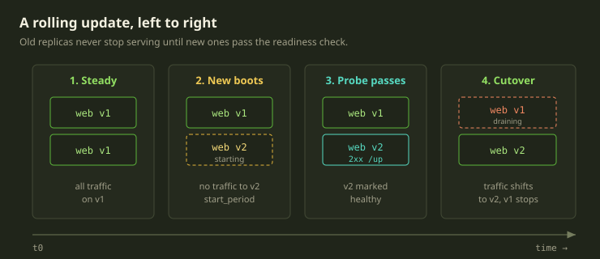
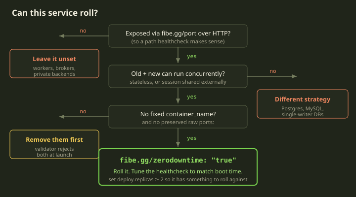
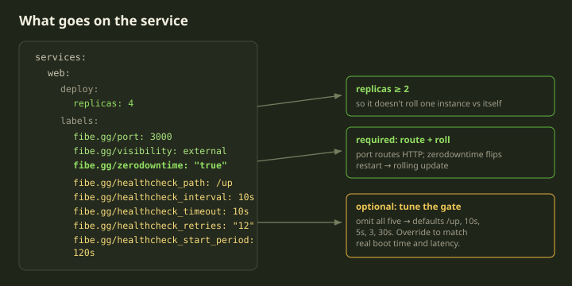
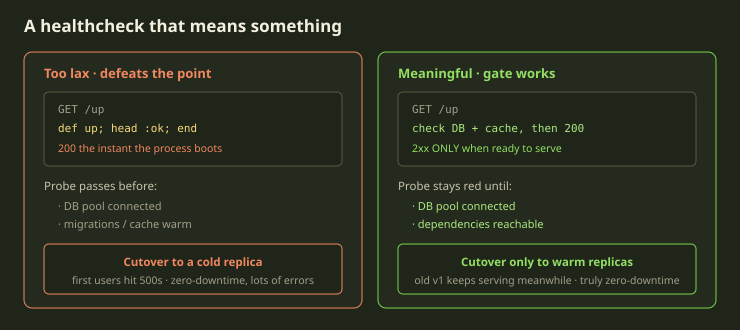

Here's the failure we want to save you from. You ship a change, your service restarts, and for the eight seconds it takes your app to boot, every request gets a connection refused or a 502. On a dev Playground nobody notices. On something people actually use during the day, those eight seconds are a pile of errors and a Slack message asking if the site is down.

The fix is one label: `fibe.gg/zerodowntime: "true"`. It flips a service from "stop the old container, start a new one" to a real rolling update — new replicas come up *alongside* the old ones, and traffic only shifts once the new ones pass a healthcheck. But the label is the easy part. The whole thing lives or dies on whether that healthcheck means anything. A healthcheck that returns `200` the instant the process boots gives you zero downtime *and* a wall of errors, because you cut traffic over to a replica that isn't actually ready. This guide is about getting both halves right.

<!-- truncate -->

## What the label actually does

By default, a Fibe service is single-instance: when you redeploy, the old container stops and a new one starts in its place. Simple, and fine for most dev environments. There's a gap between stop and start, but for a Playground you're iterating on, who cares.

`fibe.gg/zerodowntime: "true"` switches that service to **rolling updates**. The sequence is:

1. The old replicas keep serving traffic.
2. Fibe brings up new replicas next to them.
3. The new replicas get an HTTP healthcheck. They get no traffic yet.
4. Once a new replica passes the healthcheck, it's marked healthy and traffic shifts to it.
5. The old replicas drain and stop.



That step 4 is the entire value proposition. Traffic does not move to the new version until it says it's ready. So the question that decides whether this works isn't "did you add the label" — it's "does your readiness check tell the truth?"

We'll come back to the healthcheck. First: not every service should have this label at all.

## Which services can roll, and which can't

Rolling updates assume one thing above all else: **old and new can run at the same time without stepping on each other.** That's true for a stateless HTTP server. It is emphatically not true for a database.

Enable `fibe.gg/zerodowntime` only when *all* of these hold:

1. The service is exposed via `fibe.gg/port`.
2. It speaks **HTTP** — so a path-based healthcheck makes sense.
3. It can run with **multiple replicas concurrently** — stateless, or with session state in an external store.
4. It does **not** need a fixed `container_name`.
5. The template does **not** preserve raw Compose `ports:` for this service.

If any of those is false, leave the label off and take the default single-instance restart.



The "do not enable" list is worth internalizing, because some of these look superficially rollable:

| Service | Why not |
|---|---|
| Postgres / MySQL / SQLite | Stateful singleton. Running two writers at once corrupts or splits writes. |
| Redis / memcached (cache) | A cache is fine to just restart; the gain is tiny. |
| RabbitMQ / Kafka brokers | Stateful. |
| Sidekiq / Celery worker | Not HTTP — there's no healthcheck path to gate on. Use a Docker restart and a small replica count. |
| Private RPC/backend service | Not user-facing; zero-downtime *routing* usually buys you nothing. |
| Anything with host-bound `ports:` + `preserve_ports: true` | The validator rejects it. |
| Single-instance admin tools (e.g. a Sidekiq dashboard) | Marginal gain. |

:::caution
A single-writer database is the classic trap. Two Postgres containers pointed at the same data directory don't give you a smooth handover — they give you corruption. For databases you want a *different* strategy entirely (managed DB, careful migrations, a maintenance window), not a rolling update. The label isn't a "make it more reliable" switch you sprinkle on everything.
:::

## The two labels that turn it on

For a routed service, only **two** labels are strictly required to get a zero-downtime rollout — assuming you've already got `fibe.gg/port` doing the routing:

```yaml
services:
  web:
    image: ghcr.io/owner/app:latest
    labels:
      fibe.gg/port: 3000
      fibe.gg/visibility: external
      fibe.gg/zerodowntime: "true"
```

That's a complete, valid zero-downtime service. With no healthcheck labels, Fibe generates a rollout healthcheck from defaults: path `/up`, interval `10s`, timeout `5s`, retries `3`, start period `30s`.

Two more things you should add, even though they're not strictly required:

- **`deploy.replicas`** — set it to at least 2. If you have one replica, a "rolling" update rolls one instance against itself, which isn't much of a rollout. Recommended and cheap to set.
- **The `fibe.gg/healthcheck_*` overrides** — add these when the defaults don't match your app's real readiness endpoint or boot time. For a fast static server, the defaults are too patient. For a slow framework app, they're too impatient and you'll get false "unhealthy" verdicts mid-boot.



### What to remove before it'll launch

Two Compose keys are incompatible with a rolling service, and the validator will reject them rather than silently misbehave:

- **`container_name:`** — a fixed name prevents scaling past one instance, so Fibe rejects it on a zero-downtime service. Drop it.
- **Raw `ports:` host-binding** when `x-fibe.gg.metadata.preserve_ports: true` is set — Fibe rejects zero-downtime services with preserved host ports. Leave `preserve_ports` unset (the default strips raw ports before launch) or remove the raw `ports:` yourself.

What you can keep: a Compose `healthcheck:` block is fine — it's honored by Docker for `depends_on: condition: service_healthy` ordering, and it's *separate* from the Fibe rollout healthcheck. More on that distinction below.

## Now the part that actually matters: the healthcheck

Here's the thing people get wrong. They add the label, they're happy, and they wire the healthcheck to whatever returns `200` fastest — often a route that just confirms the web process is listening. That route goes green the moment the process binds the port, which is *before* the DB pool is connected, before the cache is warm, before the app can serve a real request.

So the rollout gate passes early, traffic cuts over to a cold replica, and the first users hit `500`s. You got zero downtime in the literal sense — the old version was never down — and you also served a burst of errors. The whole point was defeated by a healthcheck that lied.



The contract for the healthcheck path is short and strict:

- It returns **`2xx` only when the replica is ready to serve real traffic** — not "the process is up," but "this thing can handle a request right now."
- It's reachable on the **same `fibe.gg/port`** the service routes on.
- It's **cheap** — the probe hits it on every interval, on every replica. Don't make it run a query that touches every table.
- It's reachable **without authentication**. The platform's probes hit the endpoint directly, so they bypass the internal-visibility Basic Auth — but they can't get past *your app's* own login. Keep the healthcheck on a path your app handles before user auth. (This applies even to `fibe.gg/visibility: internal` services.)

If your app doesn't have an endpoint like that, add one *before* you enable `fibe.gg/zerodowntime`. A readiness check is a prerequisite, not an afterthought.

Common framework conventions:

| Framework | Path |
|---|---|
| Rails | `/up` |
| Node Express | app-defined; convention `/healthz` |
| Next.js | app-defined; convention `/api/health` |
| FastAPI | app-defined; convention `/healthz` |
| Phoenix | `/health` (with `live_dashboard`) or custom |
| nginx | a static `location = /healthz { return 200; }` |

Note that Rails ships `/up` out of the box, which is why it's the Fibe default. But the stock Rails `/up` only confirms the app booted without raising — if your readiness genuinely depends on the database being reachable, make `/up` check that too.

## Tuning the five `fibe.gg/healthcheck_*` labels

The five overrides map one-to-one onto the readiness behavior:

| Label | Format | What it controls |
|---|---|---|
| `fibe.gg/healthcheck_path` | absolute path beginning with `/` | The endpoint the rollout gate hits |
| `fibe.gg/healthcheck_interval` | `Nms` / `Ns` / `Nm` | How often it probes |
| `fibe.gg/healthcheck_timeout` | duration, **`< interval`** | Per-probe deadline |
| `fibe.gg/healthcheck_retries` | positive integer (quote it) | Consecutive failures before the replica is declared unhealthy |
| `fibe.gg/healthcheck_start_period` | duration | Boot grace window — probes here don't count toward `retries` |

A couple of format gotchas that will bite you:

:::caution
Durations only accept `ms`, `s`, and `m`. **No `h`, no `d`.** Write `60s`, not `1m` if you like — but never `1h`; convert it. And quote `retries` as a string (`"12"`), since the schema accepts an integer or a `[1-9][0-9]*` string and quoting avoids ambiguity. The timeout must be strictly less than the interval.
:::

Pick values from your app's actual boot time. Three profiles cover most cases:

**Fast-boot static / proxy** — boots in a second, so probe aggressively:

```yaml
fibe.gg/healthcheck_path: /healthz
fibe.gg/healthcheck_interval: 5s
fibe.gg/healthcheck_timeout: 2s
fibe.gg/healthcheck_retries: "3"
fibe.gg/healthcheck_start_period: 10s
```

**Typical web app (Node / Python / Go)** — a few seconds of boot, modest grace:

```yaml
fibe.gg/healthcheck_path: /health
fibe.gg/healthcheck_interval: 10s
fibe.gg/healthcheck_timeout: 5s
fibe.gg/healthcheck_retries: "5"
fibe.gg/healthcheck_start_period: 30s
```

**Slow-boot framework** — heavy app boot, give it room so a slow-but-fine replica isn't killed prematurely:

```yaml
fibe.gg/healthcheck_path: /up
fibe.gg/healthcheck_interval: 10s
fibe.gg/healthcheck_timeout: 10s
fibe.gg/healthcheck_retries: "12"
fibe.gg/healthcheck_start_period: 120s
```

There's a number worth keeping in your head. The approximate **maximum time before a replica is killed** is:

```
start_period + (retries × interval)
```

For the slow-boot profile that's `120s + 12 × 10s = 240s`, four minutes. Tune it to your slowest *reasonable* cold boot. Too low and a legitimately-slow boot gets killed and retried in a loop; too high and a genuinely broken replica sits there for ages before you find out.

### Compose `healthcheck:` vs the Fibe labels

These are two different things and people conflate them constantly:

- The Compose `healthcheck:` block is what Docker uses for `depends_on: condition: service_healthy` *ordering* — "don't start web until db is healthy."
- The `fibe.gg/healthcheck_*` labels tune Fibe's generated **rolling-update gate** — "don't shift traffic to this new replica until it's ready."

You can have both; they don't conflict. It's common to set them to the same values:

```yaml
services:
  web:
    healthcheck:                       # Compose: used by depends_on ordering
      test: ["CMD", "curl", "-f", "http://localhost:3000/up"]
      interval: 10s
      timeout: 10s
      retries: 12
      start_period: 120s
    labels:
      fibe.gg/healthcheck_path: /up    # Fibe: used by the rollout gate
      fibe.gg/healthcheck_interval: 10s
      fibe.gg/healthcheck_timeout: 10s
      fibe.gg/healthcheck_retries: "12"
      fibe.gg/healthcheck_start_period: 120s
```

## A worked before/after

Say you've got a Rails app already running on Fibe as a plain single-instance service:

```yaml
services:
  web:
    image: ghcr.io/acme/store:latest
    container_name: store_web
    labels:
      fibe.gg/port: 3000
      fibe.gg/visibility: external
      fibe.gg/subdomain: app
```

To make it roll: drop `container_name`, set replicas, add the `zerodowntime` label, and add a tuned healthcheck that matches a Rails app's boot. Rails is slow to boot under load, so the slow-boot profile fits:

```yaml
services:
  web:
    image: ghcr.io/acme/store:latest
    deploy:
      replicas: 4
    labels:
      fibe.gg/port: 3000
      fibe.gg/visibility: external
      fibe.gg/subdomain: app
      fibe.gg/zerodowntime: "true"
      fibe.gg/healthcheck_path: /up
      fibe.gg/healthcheck_interval: 10s
      fibe.gg/healthcheck_timeout: 10s
      fibe.gg/healthcheck_retries: "12"
      fibe.gg/healthcheck_start_period: 120s
```

If a launcher genuinely needs to tune the rollout per Playground, you can parameterize the timing with a template variable instead of hard-coding it — but resist the urge to expose all five settings. Most templates should ship a known-good profile and keep the launch form short:

```yaml
x-fibe.gg:
  variables:
    WEB_REPLICAS:
      name: "Web replicas"
      required: true
      default: "4"
      path: services.web.deploy.replicas
```

:::tip
Before you flip the label on, `curl` your readiness endpoint against a *freshly started* container — not a warm one — and confirm it returns non-`2xx` until the app is genuinely ready, then `2xx` after. If it's green from the first millisecond, your gate is a no-op and you haven't actually solved anything. This 30-second check is the highest-leverage thing in this whole guide.
:::

## How this plays with automatic recovery

Fibe already absorbs a lot of transient noise on its own, and it's worth knowing where the rollout gate ends and self-healing begins, so you don't go chasing a "problem" that isn't one.

- A **brief outage** (under a couple of minutes) is ignored. If it persists, Fibe redeploys the environment to bring it back — with backoff so it doesn't thrash (it holds off for the first 3 minutes after creation and 10 minutes after each redeploy; detection runs the whole time, only the *action* waits).
- A **single missed healthcheck** never stops or errors a *running* environment on its own — a reachable app stays viewable. The rollout gate is about *shifting traffic to a new version*; it doesn't tear down a healthy running one over one flaky probe.
- **"TLS pending" / "HTTPS provisioning"** is a normal state, not a failure — a certificate is being issued and it clears on its own, usually within a few minutes of a service first being exposed. Don't mistake it for a rollout problem.

What automatic recovery will *not* paper over is a real bug. A service that **crashes on startup** — bad image, missing variable, wrong bind address — needs you to read the logs. And critically: a **too-lax healthcheck is invisible to recovery.** If your gate goes green early and serves errors, nothing self-heals that, because from the platform's point of view the replica is "healthy." The only fix is a readiness check that tells the truth.

One caveat that surprises people: automatic recovery and redeploys only run while the **Marquee is funded**. An unfunded Marquee's environments are left exactly as they are until you fund it again — nothing self-heals in the meantime.

:::note
Tricks are the exception to all of this. A Trick is a one-shot job run (tests, a migration, a backup). Once it finishes or fails, it stays that way — Fibe never redeploys a job run on its own. Zero-downtime rollouts are a Playground concept; for a Trick, you re-run it.
:::

## The gotchas, collected

A few of these are repeated above on purpose, because they're the ones that actually cost people an afternoon:

- **Healthcheck returns `200` too early.** The single most common mistake. Cold replicas take traffic and users see errors. Tighten the endpoint to check real readiness — DB connection, cache warmed.
- **Healthcheck behind your app's auth.** Even an internal-visibility service must keep the probe path free of your app's own login. The platform's probes can't log in.
- **App writes to replica-local filesystem.** Two replicas diverge. Move state to a shared volume or an external service.
- **In-memory session state.** Rolling replicas means users get logged out mid-roll. Use Redis or signed-cookie sessions.
- **Long-running per-request work.** Old instances may be killed before in-flight requests finish. Handle `SIGTERM` in your app (Rails `at_exit`, a Node `SIGTERM` handler) to drain gracefully.
- **One replica.** A rollout with `replicas: 1` rolls an instance against itself. Set at least 2.
- **`container_name` or preserved `ports:` left in.** The validator rejects the service; remove them.

## Rules of thumb

- Turn on `fibe.gg/zerodowntime: "true"` only for **stateless HTTP services that can run old and new together.** Never for single-writer databases or one-shot jobs.
- The label is necessary but not sufficient. **A meaningful readiness healthcheck is the actual mechanism.** Returns `2xx` only when the replica can serve real traffic — not when the process merely booted.
- Set `deploy.replicas` to **at least 2** so the rollout has something to roll against.
- **Match the timing to real boot time:** fast static gets a tight profile, a heavy framework app gets `start_period: 120s` and generous retries. Keep `start_period + retries × interval` near your slowest reasonable cold boot.
- Durations are **`ms` / `s` / `m` only**; timeout `<` interval; quote `retries`.
- Before flipping it on, `curl` a *cold* container's readiness endpoint and confirm it stays non-`2xx` until ready. If it's green from the start, you have zero downtime and zero protection.
