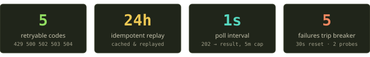
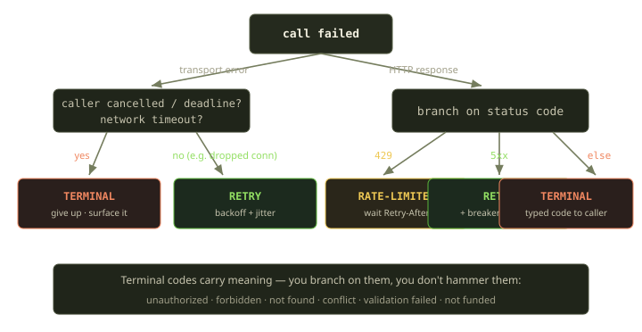
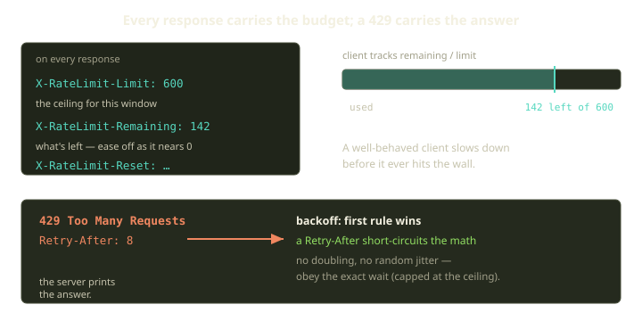
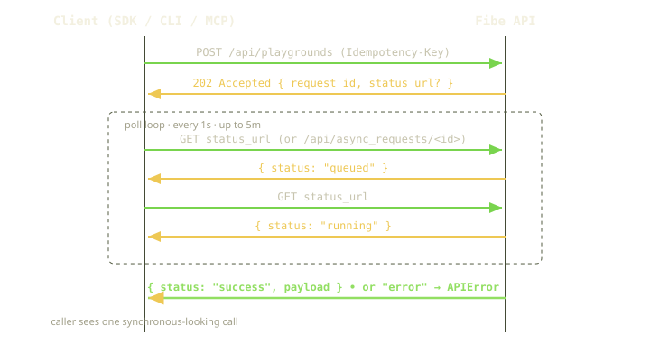
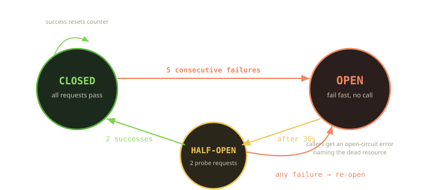

Fibe runs your code on a Marquee — a Docker host that might be a Scaleway VM in Paris or your own laptop behind a hotel Wi-Fi captive portal. Between your `fibe` command and that host sits an HTTP API, a reconciler, a websocket, Traefik, and the open internet. Every one of those hops can hiccup. So when you type `fibe playgrounds create` and the connection dies two seconds in, the only honest answer to "did it work?" is: *We don't know, and neither do you — unless we agreed on the rules beforehand.*

This post is about those rules. We call it the reliability contract: a small set of primitives — typed errors, idempotency keys, 202 polling, classified retries, a circuit breaker, and a browser layer that survives reconnects — that the Go SDK, the CLI, the MCP server, and the web UI all speak the same way. The goal is simple and a little stubborn: **you should never be left staring at a half-broken state wondering what to do next.**

<!-- truncate -->



## Why a contract instead of "just add retries"

The naive version of resilience is a `for` loop with a `sleep`. It works until it doesn't, and the ways it doesn't are exactly the ways that hurt: you retry a create and end up with two Playgrounds. You retry a 422 forever because the payload was never going to be valid. You hammer a Marquee that's already on fire. You show the user a spinner that spins until heat death because a long operation returned before it finished.

A contract fixes this by making the *meaning* of each failure explicit, and then making every client agree on how to act on that meaning. There are really only a handful of questions any client needs to answer:

1. Is this error worth retrying, or is it final?
2. If I retry a mutation, will I cause damage?
3. This operation is slow — how do I wait for it without holding a connection open?
4. The whole resource looks dead — should I stop bothering it?
5. My live connection dropped — how do I reattach without losing the user's place?

Answer those five consistently, in one place, and resilience stops being a per-call decision sprinkled across a thousand call sites. It becomes a property of the client.

## A typed error is a contract, a string is a guess

Start with the foundation: errors. The SDK never hands you a bare error with a message you're meant to grep. Every failure that comes back from the API arrives as a typed error carrying a stable, machine-readable code — an unauthorized code, a forbidden code, a not-found code, a validation-failed code, a quota-exceeded code, a conflict code, a locked code, a rate-limited code, a not-funded code, and a handful of others.

The codes are the public surface. They don't change when we reword a message for clarity, and they don't change when we refactor the server. If you've read [the post on the not-funded gate](https://blog.fibe.gg), you already know one of them intimately — that's the `402` that means your Marquee hasn't paid for today.

The error type carries everything a client needs to make a decision, not just describe one. Alongside the human-readable message it exposes the HTTP status, the stable code, a bag of structured detail, the `Retry-After` duration the server honored on a `429`, a request identifier for support and tracing, and a flag marking whether the response was an idempotent replay rather than a fresh execution.

Two of those are quietly doing a lot of work. The request identifier is stamped into the error string the user sees — a short token like `req_abc123` printed right next to the code — so a bug report comes with a thread we can pull. And the replay flag tells you that the response you're holding came from the cache, not from a fresh execution. We'll get to why that matters in a moment.

On top of the type sit predicates, so callers branch on intent instead of integers. A client can ask "is this the not-funded case?" and route the user to top up — that's a money problem, never worth retrying — or ask "am I being rate limited?" and back off, trusting that the SDK already read the `Retry-After` off the response.

This is the difference between a contract and a guess. "Is this the not-funded case?" is a fact the server asserted; substring-matching the word "funded" out of an error message is a hope.

## Retryable vs terminal: the one decision everything hangs on

Given a failure, the very first fork is binary: try again, or stop. Get it wrong in one direction and you give up on a blip; get it wrong in the other and you DDoS yourself.

The SDK draws the line at the HTTP status. Exactly five codes are retryable: **429** (rate limited), and the four server and gateway faults — **500, 502, 503, 504** — that mean "this might work if you ask again." Everything else is terminal *on purpose*. A `401` won't fix itself by being asked twice. A `422` validation failure is a bug in your request, not a transient fault. A `409` conflict means the world moved under you and you need to re-read, not re-send. Retrying any of those is just a slower way to fail.

Transport-level errors — the request that never even got an HTTP response — need their own judgment, and here the SDK is deliberately conservative. It declines to retry in three situations: when it has already used up its retry budget, when the caller cancelled the request or let its deadline pass (their intent is respected), and — the subtle one — when the failure was a network *timeout*. Everything else at the transport layer is treated as safe to try again.

That timeout case is the subtle one. A dropped connection — a reset, an `EOF` mid-handshake — is safe to retry; the request almost certainly never reached the server. A **timeout** is a different animal: the request may well have arrived and be running *right now* on the far side. Retrying it blindly is how you get two Playgrounds. So we don't auto-retry timeouts on a bare call. The safe way to make a timed-out mutation retryable is to make it idempotent — which is the whole point of the next section.



When a retry *is* warranted, the backoff is exponential with jitter, and it yields to the server when the server has an opinion. The precedence is simple: if the server attached a `Retry-After`, the client obeys that exact wait (capped at its own ceiling) and skips the math entirely. Absent that, it computes a delay that doubles with each attempt, clamps it to the ceiling, and then multiplies it by a random fraction between zero and one.

That last multiplication — the jitter — isn't decoration. If a Marquee blips and a hundred clients all back off by exactly the same doubling schedule, they retry in lockstep and re-create the stampede that knocked it over. Multiplying by a random factor smears them across the window. It's the cheapest line in the whole policy and one of the most important.

:::tip
On a `429`, the SDK reads `Retry-After` and the `X-RateLimit-*` family directly off the response headers — `X-RateLimit-Limit`, `X-RateLimit-Remaining`, `X-RateLimit-Reset`. You rarely have to think about rate limiting at all; the client tracks your budget and waits exactly as long as the server asked, no more.
:::

## A 429 is not a 503: rate limits get their own lane

It's tempting to lump a `429` in with the `5xx` family — they're all "retryable," after all — and just let the backoff math handle every one of them. But a rate limit is a fundamentally different signal from a server fault, and the SDK treats it that way. A `503` says *I'm broken, try later and I'll guess how long.* A `429` says *you're fine, I'm fine, but you've spent your budget — and here is exactly when it refills.* The first calls for a guess; the second comes with an answer printed on the response.

Every response — not just the failures — carries the rate-limit ledger in its headers, and the SDK reads it on the way through:

```http
HTTP/1.1 429 Too Many Requests
Retry-After: 8
X-RateLimit-Limit: 600
X-RateLimit-Remaining: 0
X-RateLimit-Reset: 1717503600
```

`X-RateLimit-Limit` is your ceiling for the window, `X-RateLimit-Remaining` is what's left in it, and `X-RateLimit-Reset` is the Unix timestamp when the bucket refills. The client tracks all three so it always knows where it stands in its budget — which means a well-behaved caller doesn't have to *hit* a `429` to slow down; it can see the remaining count trending toward zero and ease off on its own.

When a `429` does land, the precedence is unambiguous: the server's `Retry-After` wins over any computed backoff. Recall the backoff rule from earlier — its very first check is whether a `Retry-After` was given, and if so it returns that wait directly, short-circuiting the doubling-and-jitter math entirely. There's no point rolling random dice when the server has told you the exact second it'll be ready. The only adjustment the client makes is the cap: if a server ever asks for a wait longer than the client's own ceiling, the client honors that ceiling rather than sleeping for an arbitrarily long time on someone else's say-so.



The distinction pays off in load: under a generic-retry scheme, a hundred clients that all hit the wall at once would each independently re-derive a backoff and drift apart only by luck. Under `Retry-After`, the server can actively *shape* the herd — handing out staggered waits so the budget refills smoothly instead of in a single synchronized thundering reload. The client's job is just to be honest and obey the number it was given.

## Idempotency: making "we don't know" safe to act on

Back to the timeout problem. You sent `Playgrounds.Create`, the connection timed out, and you genuinely cannot tell whether a Playground exists now. The retry you *want* to do is the retry you *can't safely* do — unless the server can recognize that your second request is the same as your first.

That's an idempotency key: a token you generate **before** the request, attach to it, and reuse on every retry of that same logical operation. The SDK gives you a helper to mint one and a way to bind it to the call's context; once it's attached, that create — or any other mutation — is safe to retry.

The key itself is nothing clever: sixteen random bytes rendered as hex, just enough entropy that two distinct operations never collide. The cleverness lives server-side. The API caches the response for that key for **24 hours** and replays it on any duplicate. The mutation runs *once*. The second, third, and fourth attempts all get the same answer the first one would have, and the response comes back stamped `X-Idempotent-Replayed: true` — which surfaces in the SDK as the replay flag you saw earlier.

So the failure mode dissolves. Timed out mid-create? Send it again with the same key. Either the original landed (you get its result back, replayed) or it didn't (it runs now). You can't end up with two. The contract turns "we don't know if it worked" from a dead end into a shrug.

:::note
Reach for a key on anything that mutates and that you might retry: create, rollout, restart, sync. Reads don't need one — `GET` is already idempotent by definition. The CLI and MCP layers attach keys to their mutating commands automatically, so a flaky `fibe playgrounds restart` is safe even when you didn't think about it.
:::

## 202 and the art of waiting well

Some operations are genuinely slow. Provisioning a Marquee, rolling out a Playground, healing a wedged container — these take seconds to minutes, far longer than any sane HTTP timeout. Holding a connection open for the whole ride is how you collect 504s from every proxy in the path.

So Fibe doesn't. A long operation returns immediately with **`202 Accepted`** and a handle:

```http
HTTP/1.1 202 Accepted
Content-Type: application/json

{ "request_id": "a1b2c3...", "status": "queued", "status_url": "/api/async_requests/a1b2c3" }
```

The work continues on the server; the client polls the handle until it reaches a terminal state. The status vocabulary is small and total: **`queued`** and **`running`** are pending; **`success`** and **`error`** are terminal. The SDK does the polling for you — it sees the `202` and then polls on a loop, once a second, for up to five minutes before it gives up. If the response carries an explicit status URL, the client follows that instead of constructing the path itself — the server stays in control of where its own status lives. From the caller's seat none of this is visible: you `await` one method, and it returns when the work is actually done.



When an async operation fails, it doesn't fail vaguely. The terminal `error` status carries a stable error code, and the SDK promotes it back into the very same typed error you'd get from a synchronous call. If the server didn't name a code, the SDK substitutes a generic remote-request-failed code so you never get an empty error. The whole point is that **async failures and sync failures look identical to your code** — same type, same predicates, same branching. You don't write two error-handling paths.

Playgrounds get an even richer treatment. A Playground that lands in a terminal failure state comes back with a dedicated terminal-state code, plus details that actually help you debug: the reason or reasons for the state, the step that broke, build statuses, and failure diagnostics. That's the difference between "rollout failed" and "rollout failed at the `docker compose build` step because the base image 404'd" — one is a shrug, the other is a fix.

### The poll loop on the wire

It's worth seeing the whole exchange in the raw, because the elegance is in how little the client has to think. You `POST` a rollout; the API doesn't make you wait for the `docker compose` to finish — it hands back a `202` and a place to look:

```http
POST /api/playgrounds/pg_8f3a/rollout HTTP/1.1
Idempotency-Key: 9f2c4ad17b0e5c83
Content-Type: application/json

HTTP/1.1 202 Accepted
Content-Type: application/json

{ "request_id": "req_5c1d", "status": "queued",
  "status_url": "/api/async_requests/req_5c1d" }
```

From here the client follows the status URL verbatim — it does *not* assemble the path from the request identifier itself. If the server one day decides async status lives on a different host or under a different prefix, the client follows along without a code change. The rule is quiet but firm: when the `202` carries an explicit status URL, that wins; only when it's absent does the SDK fall back to the conventional `/api/async_requests/<id>` path. Then it polls, once a second:

```http
GET /api/async_requests/req_5c1d HTTP/1.1

HTTP/1.1 200 OK
{ "status": "running" }
```

It keeps polling on that one-second cadence until the status crosses into a terminal value. A clean finish returns the resource the original `POST` would have, had it been synchronous:

```http
GET /api/async_requests/req_5c1d HTTP/1.1

HTTP/1.1 200 OK
{ "status": "success",
  "result": { "id": "pg_8f3a", "state": "running", "url": "https://..." } }
```

And a failure comes back not as a bare `500` but as a named, classifiable thing — the same shape every other error in this post has. The terminal status carries a stable code and a details bag naming which step broke and why:

```http
HTTP/1.1 200 OK
{ "status": "error", "code": "...",
  "details": { "step": "build", "reason": "image_pull_failed" } }
```

In Go, all of that collapses to a single call. The SDK runs the poll loop, wires the `202` into it, and promotes the terminal `error` status into the same typed error you'd get synchronously — before it ever reaches you. You call the rollout method, check the returned error, branch on its stable code exactly the way you'd branch on a synchronous failure, and read the failed step straight out of its details. There is no second error-handling path for "the async kind"; it's the same predicate machinery throughout.

If five minutes elapse and the status is still `queued` or `running`, the poll loop gives up with a timeout rather than spinning forever — the same five-minute ceiling the SDK applies by default. A genuinely stuck operation surfaces as a deadline, not a hang, and Playguard keeps reconciling the host underneath regardless.

## The circuit breaker: knowing when to stop knocking

Retries and idempotency handle the *blip*. They're the wrong tool for the *outage*. If a Marquee is genuinely down — host unreachable, Docker daemon wedged, the VM rebooting — then every retry is just latency you're adding to an answer you already have. Worse, a thundering crowd of retrying clients can keep a recovering host pinned to the floor.

The circuit breaker is the part of the client that learns to stop knocking. It's a three-state machine wrapped around a resource:



The defaults are deliberately small numbers you can reason about: it takes **five** consecutive failures to open the breaker, it stays open for **30 seconds**, and it admits **two** probes before declaring the resource recovered.

In **closed** state every request passes and a success quietly resets the failure counter. Rack up five consecutive failures and the breaker flips to **open** — and now the client fails *fast*, before the network call, handing you a dedicated open-circuit error that names the dead resource.

That naming matters. When the message reads "circuit breaker open for marquee/prod-eu — too many recent failures," you know which thing is sick and that the client made a deliberate choice not to wait on it. No mystery hang.

After 30 seconds the breaker moves to **half-open** and lets a small number of probes through. Two clean successes and it closes again, fully recovered. But a single failure during that probe window — meaning the resource is still sick — slams it straight back open for another 30 seconds. It doesn't optimistically reopen the floodgates the instant the timer expires; it tests the water with two toes first.

The breaker and the async layer are wired together: the same call path that polls async work records a success on every `2xx` and a failure on every `5xx`, so the breaker's view of a resource's health is built from real traffic, not a separate health check that can lie. The reconciler — Playguard, which re-checks every environment every 60 seconds — is healing the host on its own schedule; the breaker just keeps your client from getting in the way while it does.

### Why the breaker is the antidote to a thundering herd

The failure mode the breaker exists to prevent is worth spelling out, because it's counterintuitive: retries are *most* dangerous exactly when they're *most* tempting. Picture a Marquee that's just rebooting. It'll be back in fifteen seconds. But in those fifteen seconds, every client with work queued against it is failing — and every one of those failures, under a naive retry policy, becomes another request. The host comes back up into a wall of accumulated retries, buckles, and goes down again. That's a thundering herd, and backoff-with-jitter only softens it; it doesn't stop it, because jitter spreads requests across a window but never *removes* them.

The breaker removes them. Once it's open, requests fail *before* the network call — the open-circuit error is returned synchronously, no packet leaves the client. So the recovering host sees not a softened flood but actual silence: for 30 seconds, the clients that tripped their breakers send it nothing at all. Then the half-open state sends exactly two probes — not the whole backlog, two — to ask politely whether it's ready. If it is, the gate opens and normal traffic resumes. If it isn't, those two probes are the *only* cost of finding out, and the breaker slams shut for another quiet 30 seconds. The host always recovers into calm, never into a stampede. That's the property worth paying for: the breaker converts "many clients hammering a sick host" into "many clients waiting, then two clients knocking."

## The browser speaks the dialect too

Everything above is the SDK, and it covers the CLI and MCP for free — they're thin shells over the same client. But most people meet Fibe through the web UI, and a browser tab on a flaky connection is its own special kind of fragile. Two things in particular have to survive a reconnect without the user noticing: the **live SSH terminal** and the **live preview iframe**.


### One-shot terminal recovery

The in-browser terminal streams over ActionCable. When the underlying SSH session expires, the server pushes a `session_expired` status. The tempting thing to do is reconnect immediately — and the tempting bug is to do it *every* time the message arrives, which on a genuinely broken session becomes a reconnect storm that fills the console with churn.

So recovery is strictly one-shot, gated on a flag. The first `session_expired` triggers exactly one recovery attempt — refresh the cable URL, reset the connection, resubscribe — and then sets a "already tried" flag. Any further expiry messages are ignored until that flag is cleared, and it clears only on a clean (re)connect. One expiry, one attempt, no storm. We assert this behavior across every streaming controller in our JavaScript specs, because "reconnect once, not forever" is the kind of invariant that quietly rots the moment nobody's watching it.

### The iframe that refuses to die

The live preview is harder. It's a real iframe running your real app, mid-session — scroll position, half-filled forms, open websockets, the lot. Meanwhile the page around it is a Turbo app that constantly morphs the DOM and streams updates. A normal Turbo morph would happily swap that iframe out and blow your session away on every keystroke that triggers an update. Unacceptable.

The fix is a set of continuity guards that recognize a *protected* iframe — one marked ready, session-protected, and stamped with a known ready-version marker — and shield it from updates that would needlessly reset it. The governing rule is beautifully simple: **does the URL actually change?**

- A morph or stream update aimed at the same URL is preserved. The guard cancels the default swap and emits a "protected stream blocked" event so the rest of the page knows what happened. Your iframe keeps running.
- An update that changes the URL is allowed through — that's a genuine navigation to a new session, and reloading is the correct behavior.
- Missing panes are imported in place — appended into the layout — so we can patch the surrounding page *without* ever resetting the live iframe's source.

There's one more layer of paranoia, and it's the kind users feel even if they can't name it: a whole-page refresh is **deferred** while a form is dirty or focused, or while pending forms would be caught in a morph. Nobody loses a half-typed comment to a background reconnect. The refresh waits its turn.

It is, frankly, a lot of machinery to make nothing happen. But "nothing happens" — your terminal stays scrolled where you left it, your preview keeps running, your form keeps your text — is exactly the experience a flaky network is constantly trying to take from you.

## One dialect, four clients

Pull back and the shape is clear. The same five answers show up everywhere:

| Concern | Primitive | Default |
|---|---|---|
| Is this final? | Typed error + a retryable verdict | retry only 429 / 500 / 502 / 503 / 504 |
| Safe to retry a mutation? | Idempotency key | server caches & replays for 24h |
| How to wait on slow work? | 202 + poll | 1s interval, 5m timeout |
| Don't make a retry worse | Backoff + jitter, honor `Retry-After` | exponential, capped, randomized |
| Stop knocking on a dead host | Circuit breaker | open after 5, reset after 30s, 2 probes |
| Keep the UI alive | One-shot reconnect + protected iframe | one attempt per expiry; preserve same-URL |

The Go SDK implements it once. The CLI and MCP server inherit it because they're built on the SDK. The browser re-implements the *same dialect* in JavaScript because it has to — a websocket isn't an HTTP client — but it makes the same promises. That's the property we actually care about: whichever door you walk in, the system behaves the same when things go wrong.

### Why a single dialect beats five good ones

The reason this matters isn't tidiness for its own sake. It's that the primitives only deliver their full value when they *compose*, and they only compose if everyone speaks them the same way.

Watch them stack up on a single flaky `fibe playgrounds rollout`. The CLI attaches an idempotency key without being asked, because mutating commands always do. The rollout is slow, so it comes back `202` and the SDK transparently polls it to a terminal state. Halfway through, the Marquee blips with a `503`; the retry classifier sees a `5xx`, the backoff adds jitter, the breaker ticks a failure. The blip clears, the poll resumes, the breaker's counter resets on the next `2xx`. The operation completes — and from the user's seat it looked like one command that took a little while. No layer of that knew it was cooperating with the others; they just shared the same vocabulary of typed error codes, the same retryable-or-not verdict, the same idempotency contract. *That's* composition: each primitive trusts that the next one classifies failure identically.

Now imagine the alternative — the CLI, the SDK, the MCP server, and the browser each inventing their own "good enough" resilience. Five reasonable engineers would draw the retryable/terminal line in five slightly different places. One would retry `409`s. One would forget jitter. One would treat a timeout as safe to replay and quietly double-create. The bugs wouldn't show up in code review; they'd show up as a support ticket that only reproduces from the MCP path on a Tuesday. A shared dialect doesn't just reduce duplication — it makes the resilience *auditable*. There's exactly one place that decides what's retryable, one place idempotency keys are minted, one set of breaker defaults. When we want to change a default, we change it once and every client inherits it. And when something does go wrong, we already know the vocabulary the bug is speaking.

## What we learned

A few things crystallized building this that we'd hand to anyone wiring up resilience on a remote-first platform:

- **Classification beats retrying.** The most valuable line in the whole stack isn't the retry loop — it's the classifier that decides what's even retryable. Retrying a `422` forever is worse than failing immediately, because it fails *slowly* and hides the real bug.
- **Idempotency is what makes timeouts survivable.** A timeout is the one error you genuinely cannot classify from the outside; the request might have landed. A client-generated key is the only honest way to make that retry safe, and it costs sixteen random bytes.
- **A breaker is a courtesy, not just a safeguard.** Failing fast protects *you* from latency, but it also protects a recovering host from your retries. The 30-second cool-down and the two-probe recovery exist so we don't kick a host while it's getting back up.
- **The browser deserves the same rigor as the SDK.** It's tempting to treat the UI as best-effort. But a reconnect storm or a wiped scrollback is exactly the kind of half-broken state the whole contract exists to prevent. "Reconnect once" and "preserve the same-URL session" are real invariants, and we test them like real invariants.

None of these primitives is novel on its own — backoff, idempotency keys, breakers, and reconnect logic are old ideas. What's worth stealing is the discipline of making *every* client speak the same one, so that resilience is something the platform *is*, not something each caller has to remember to add. On a system that lives on flaky remote hosts, that's the difference between "it usually works" and "you can trust it."
