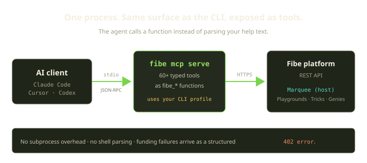
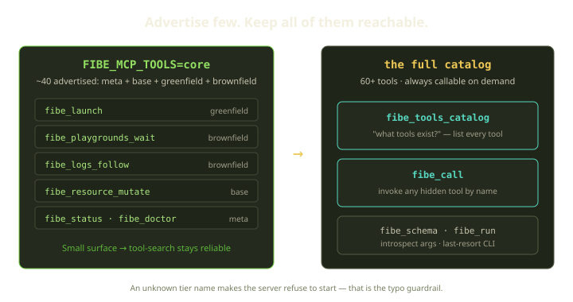
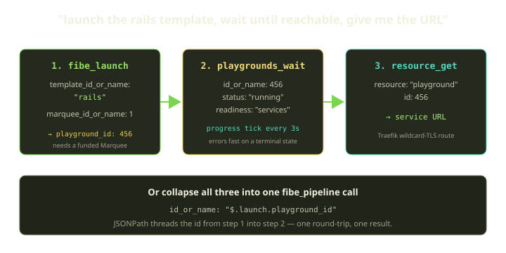
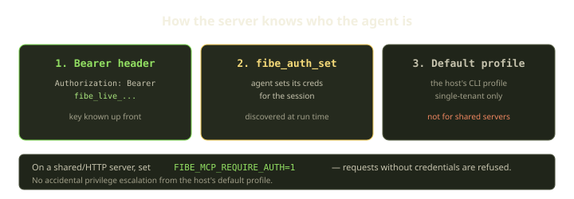

Your coding agent is great at writing the diff. It is much worse at the part that comes after: spin up an environment, wait for it to actually come up, hand you a URL, tail the logs when something breaks. Today it does that by shelling out to the `fibe` CLI and string-matching the help text — which works until the agent invents a flag that doesn't exist, or misreads "building" as "ready," and you spend ten minutes untangling what it thought it did.

The Fibe MCP server fixes the seam. The same `fibe` binary you already have doubles as a [Model Context Protocol](https://modelcontextprotocol.io) server, exposing the entire platform as **typed tools** an agent calls directly — no subprocess, no shell parsing, no guessing. This guide walks you through wiring it into Claude Code, Cursor, or Codex, choosing how many tools to put in front of the agent, and what it can actually do once it's connected. By the end you'll have an agent that can take "launch the rails template and give me the URL when it's up" and just do it.

<!-- truncate -->

## The mental model

Here is the whole thing in one picture. Your AI client talks to a local `fibe mcp serve` process over stdio (plain JSON-RPC on a pipe). That process holds your credentials, translates each tool call into a real Fibe API request, and the platform drives your Marquee — the Docker host where your Playgrounds, Tricks, and Genies actually run.



The key property: the agent isn't running `fibe launch --marquee 1` and parsing stdout. It's calling a function named `fibe_launch` with structured arguments and getting back structured JSON. When a tool fails because a Marquee is unpaid, it doesn't get a cryptic exit code — it gets a real MCP error with HTTP status `402`, a payment-required "this Marquee isn't funded" response that it can reason about and report back to you cleanly.

:::note
You don't need to learn a new auth story. By default the server inherits your active CLI profile — whatever `fibe auth use` is pointing at. If `fibe doctor` works in your terminal, the MCP server works.
:::

## Step 1: install into your client

The fastest path is the `fibe mcp install` helper. It writes the right config snippet for whichever client you name and prints exactly what it added, so there's no hunting for the config file format:

```bash
# Pick your client.
fibe mcp install --client claude-code
fibe mcp install --client claude-desktop
fibe mcp install --client cursor
fibe mcp install --client vscode
fibe mcp install --client antigravity
fibe mcp install --client codex
```

If your client isn't on that list, the snippet is small enough to write by hand. Here's the canonical shape, using Claude Code as the example:

```jsonc
{
  "mcpServers": {
    "fibe": {
      "command": "fibe",
      "args": ["mcp", "serve"],
      "env": {
        "FIBE_API_KEY": "fibe_live_yourkeyhere"  // or omit and use the default profile
      }
    }
  }
}
```

Restart the client. It launches `fibe mcp serve` on startup, and the tools show up in the agent's tool list namespaced as `fibe_*` — `fibe_launch`, `fibe_status`, `fibe_logs_follow`, and so on.

:::caution
The single most common install failure is the client not finding `fibe` on `PATH`. GUI clients often run with a thinner environment than your shell. If the server won't start, set an absolute path: `"command": "/usr/local/bin/fibe"`. And if calls come back with "no credentials," run `fibe doctor` **outside** the client to confirm your profile or `FIBE_API_KEY` is actually set for the environment the client runs as.
:::

### Running the server by hand

`fibe mcp install` is just writing config that runs one of these for you. It's worth knowing them directly, because the transport you pick depends on who's connecting:

```bash
# Stdio (default) — for a local, single-tenant agent like Claude Code on your laptop.
fibe mcp serve

# SSE — Server-Sent Events over HTTP. Multi-tenant capable.
fibe mcp serve --http :4400

# Streamable HTTP — JSON-RPC over HTTP. Multi-tenant capable.
fibe mcp serve --http :4400 --streamable
```

For one human at one machine, stdio is what you want and the default does the right thing. Reach for `--http` only when you're hosting the server somewhere shared — a team relay, a SaaS backend, a Worker — which brings its own auth requirements (more on that below).

:::tip
In stdio mode, stdout **is** the JSON-RPC channel. The server deliberately reroutes any stray writes — its own logs, panic traces, a wrapper script's `echo` — to stderr so they don't corrupt the protocol pipe. If you wrap `fibe mcp serve` in a script that prints anything to stdout, the client will report parse errors like `invalid message version tag`. Keep that pipe clean; read diagnostics from stderr, which most MCP hosts surface as a debug log.
:::

## Step 2: decide how many tools to advertise

Fibe ships 60+ tools across nine families. That's a feature for capability and a liability for reliability: the more tools you put in front of an agent, the worse its tool-search gets. With a hundred near-synonymous functions in working memory, an agent picks `fibe_resource_mutate` when it wanted `fibe_playgrounds_action`, or burns a turn deliberating. Curation is the single biggest lever you have on agent reliability here.

So the server lets you narrow the advertised surface with one env var:

```bash
FIBE_MCP_TOOLS=core fibe mcp serve         # day-to-day surface (~40 tools)
FIBE_MCP_TOOLS=full fibe mcp serve         # everything (this is the default)
FIBE_MCP_TOOLS=meta,base fibe mcp serve    # specific tiers, comma-separated
```

The tier names are `meta`, `base`, `greenfield`, `brownfield`, `overseer`, `local`, and `other`, plus the two shortcuts `core` and `full`. `core` is `meta + base + greenfield + brownfield` — the tools you reach for in everyday work. `full` is the lot.

:::caution
An unknown tier name makes the server **refuse to start**. That's a deliberate guardrail: a typo like `FIBE_MCP_TOOLS=cores` fails loudly at boot instead of silently advertising an empty tool list. If your agent's tool list comes back empty, that env var is the first thing to check.
:::

The part that makes curation safe rather than limiting: the full catalog stays reachable even when it isn't advertised. Two meta-tools are the escape hatch.



- **`fibe_tools_catalog`** — the agent calls this to list every tool with its description and annotations. It's the table of contents, as a tool. An agent that doesn't recognize what you're asking can look up what exists.
- **`fibe_call`** — dynamic invocation of any tool by name, including ones not in the advertised list. This is how the agent reaches a deeper tool like `fibe_templates_change`, which is intentionally hidden from the native list precisely because it's advanced.

So the pattern is: advertise a small, high-signal set so the agent's first instinct is usually right, and let it discover-and-invoke the long tail on demand. Most agents do fine on `core` for daily work and only need `full` when they're reaching for an escape hatch.

| Want | Set | Why |
| --- | --- | --- |
| Everyday agent on your laptop | `FIBE_MCP_TOOLS=core` | Reliable tool-search; long tail still reachable via `fibe_call` |
| Maximum capability, you'll babysit | `full` (default) | Every tool advertised; more choices, more chance of a wrong pick |
| A narrow, scripted automation | `meta,base` | Hand the agent exactly the tiers the job uses |
| "Why is my tool list empty?" | check the value | Unknown tier refused at boot; valid-but-narrow tier may match nothing |

## What the agent can actually do

With the server connected, the agent has the same reach the CLI does. Grouped by what they touch:

| Family | Representative tools | What it's for |
| --- | --- | --- |
| Auth & meta | `fibe_auth_set`, `fibe_doctor`, `fibe_status`, `fibe_schema`, `fibe_tools_catalog`, `fibe_call` | Bootstrap a session; introspect what's available |
| Resource CRUD | `fibe_resource_list`, `_get`, `_mutate`, `_delete`, `_watch` | The five verbs over every resource family |
| Greenfield | `fibe_launch`, `fibe_greenfield_create`, `fibe_templates_search` | "Build me the whole thing" from a template or repo |
| Playgrounds | `fibe_playgrounds_wait`, `fibe_logs_follow`, `_action`, `_debug`, `_switch_template` | Operate long-lived environments |
| Pipelines | `fibe_pipeline`, `_pipeline_result` | Compose several calls into one round-trip |
| Monitoring | `fibe_monitor_follow`, `fibe_mutter` | Tail the live event stream; leave notes |

A natural starting move is `fibe_status` — a pure, read-only dashboard of what you've got:

```jsonc
{ "tool": "fibe_status", "args": {} }
```

```json
{
  "playgrounds": { "total": 12, "active": 9, "stopped": 1 },
  "agents": { "total": 4, "authenticated": 3 },
  "marquees": 2,
  "subscription": { "plan": "single", "playground_limit": 50 }
}
```

`playgrounds.active` counts `running` plus `building` — not `stopped`, not `error`. It's a good first call for an agent to orient before it starts creating things, and it's a safe one: no side effects, no events, no logs. (The detailed `resource_quotas` and `rate_limits` blocks only appear when you authenticate with an API key, not a session cookie.)

:::note
Anything that launches, rebuilds, streams from, inspects, schedules, stops, deletes, or otherwise talks to a Marquee requires that Marquee to be funded. The agent will see a payment-required `402` "this Marquee isn't funded" response and should surface it to you rather than retry blindly.
:::

## A worked example: launch, wait, URL

Let's make the canonical request concrete: *"launch the rails template, wait until it's reachable, then give me the URL."* That's three tool calls, and it's worth seeing why each step is what it is.



**Step 1 — launch.** `fibe_launch` is the greenfield workhorse: it creates a Playspec and, when you give it a Marquee, deploys a Playground. Here the source is an existing Import Template by name:

```jsonc
{
  "tool": "fibe_launch",
  "args": {
    "template_id_or_name": "rails",
    "marquee_id_or_name": 1
  }
}
```

It returns a small envelope:

```json
{ "playspec_id": 123, "playground_id": 456, "props_created": [] }
```

Two things to internalize. First, `fibe_launch` takes *exactly one* source field — a template, a template version, a Playspec, an inline Compose body, or a repo URL — and they're mutually exclusive. Second, `playground_id` comes back `0` if you didn't pass a Marquee (you'd get just the Playspec). The moment you do name a Marquee, the launch deploys a live Playground by default, so you get a real running environment — `456` here.

**Step 2 — wait, the right way.** This is the step the CLI-shelling agent gets wrong. `fibe_playgrounds_wait` polls the Playground's status on a fixed interval until it hits your target, and crucially it understands *readiness*:

```jsonc
{
  "tool": "fibe_playgrounds_wait",
  "args": {
    "id_or_name": 456,
    "status": "running",
    "readiness": "services",
    "timeout": "5m"
  }
}
```

`readiness: "services"` (the default when the target is `running`) waits for the services to actually report ready — not just for the top-level lifecycle status to flip. That's the difference between "reachable" and "the container exists." Three more behaviors that make this safe to hand to an agent:

- It emits an MCP **progress notification on every tick** (`status: <state>`), so clients like Claude Code and Cursor show a live status indicator instead of a long silent wait.
- It **errors out immediately** on a terminal state — `error`, `failed`, `destroyed` — that doesn't match your target. The agent won't poll a permanently-broken Playground until the timeout.
- It polls a cached copy of the status, which the Marquee writes asynchronously, so expect a small lag between actual container state and what `wait` observes.

**Step 3 — the URL.** Once it's `running`, fetch the Playground and read its service URL off the response:

```jsonc
{ "tool": "fibe_resource_get", "args": { "resource": "playground", "id": 456 } }
```

The URL is a Traefik-routed, wildcard-TLS address. Hand it to the human and you're done.

### Collapse it into one pipeline call

Three calls means three model round-trips. For a chain this predictable, `fibe_pipeline` — the most powerful tool in the catalog — runs the whole plan server-side in one request and threads results between steps with JSONPath bindings:

```jsonc
{
  "tool": "fibe_pipeline",
  "args": {
    "steps": [
      {
        "id": "launch",
        "tool": "fibe_launch",
        "args": { "template_id_or_name": "rails", "marquee_id_or_name": 1 }
      },
      {
        "id": "ready",
        "tool": "fibe_playgrounds_wait",
        "args": {
          "id_or_name": "$.launch.playground_id",
          "status": "running",
          "readiness": "services",
          "timeout": "5m"
        }
      }
    ],
    "return": "$.launch"
  }
}
```

`"$.launch.playground_id"` pulls the id from step one's output straight into step two — no model in the loop between them. Pipelines also support `parallel: [...]` blocks and `for_each` loops, cache their results for five minutes (look one up later with `fibe_pipeline_result`), and on a mid-run failure return `status: "partial"` with a `completed_step_ids` list so you know exactly what got created before the error. One caveat: pipelines don't nest — a step that calls `fibe_pipeline` is rejected.

## Mutating, following, operating

The same connected agent handles the day-after work, not just the launch.

**Tail logs while it works.** `fibe_logs_follow` streams live logs with progress notifications, so "show me what auth-service is doing right now" is a real-time experience rather than a snapshot:

```jsonc
{ "tool": "fibe_logs_follow", "args": { "id_or_name": "auth-service" } }
```

**Operate the Playground.** `fibe_playgrounds_action` covers rollout, hard-restart, stop, start, retry, and maintenance toggles. The standard operate-and-confirm pattern pairs an action with a wait:

```jsonc
{ "tool": "fibe_playgrounds_action",
  "args": { "id_or_name": 456, "action_type": "rollout", "confirm": true } }
```

Notice the `confirm: true`. By default the server gates destructive tools — delete, rollout, switch-template apply — behind a confirm argument. A call without it comes back with a "confirmation required" error, forcing the agent to deliberately re-call. That gate exists because LLM agents occasionally ask for more than they should. You *can* disable it with `FIBE_MCP_YOLO=1` (or `--yolo`), but do that sparingly and never on a shared server — a confused agent with the gate off can delete things.

**Watch the event stream.** `fibe_monitor_follow` tails events live, filtered by type or text, which is the basis for "babysitting" workflows where the agent watches an environment and chimes in on noteworthy events:

```jsonc
{ "tool": "fibe_monitor_follow", "args": { "type": "message,artefact", "q": "error" } }
```

## Profile-based auth, and the safety of it

For a local agent, auth is a non-event: the server uses your default profile and you're done. The interesting case is the shared server, where every connecting agent needs its own identity. Three modes stack:



1. **`Authorization: Bearer <fibe-api-key>` header** — the agent sends its key on each request. Use this when the key is known up front.
2. **`fibe_auth_set` tool** — the agent calls this first to set credentials for the session. Useful when the credential is fetched at run time (say, from a vault).
3. **Default profile fallback** — the host's own profile. Single-tenant only; never appropriate for a shared deployment.

The guardrail that makes a shared server safe is one env var:

```bash
FIBE_MCP_REQUIRE_AUTH=1 fibe mcp serve --http :4400   # or pass --require-auth
```

With it set, the server **refuses any request that doesn't carry credentials** — no accidental privilege escalation from the host's default profile, no agent quietly acting as you because it forgot to authenticate. For multi-tenant hosting, treat `FIBE_MCP_REQUIRE_AUTH=1` and `--http` as a pair; the `Authorization` header is only honored on the HTTP transport, since stdio is inherently single-tenant.

## When the agent gets confused

Two introspection tools are worth teaching your agent to reach for, because they turn "I don't know how to do this" into "let me look it up":

```text
fibe_tools_catalog        # list every tool, with descriptions and annotations
fibe_schema               # ask for the JSON schema of a tool's args
fibe_help <command>       # CLI help for the equivalent command
```

Every tool also carries three annotations from the live catalog — **Destructive**, **Idempotent**, **Read-only** — and the agent can read them via `fibe_tools_catalog`. Idempotent tools are safe to retry; read-only tools (`fibe_status`, `fibe_playgrounds_wait`) are safe to call freely. A well-behaved agent leans on the read-only and idempotent ones liberally and treats the destructive ones with the `confirm` gate it's given.

A quick triage table for the failures you'll actually hit:

| Symptom | Fix |
| --- | --- |
| Client can't find `fibe` | Put it on `PATH` for the user the client runs as, or set an absolute `command` path |
| Calls fail with "no credentials" | Profile unset or `FIBE_API_KEY` missing for that env — run `fibe doctor` outside the client |
| Tool list is empty | Check `FIBE_MCP_TOOLS` — likely a typo'd or empty-matching tier |
| Agent gets stuck waiting | The confirm gate fired — retry with `confirm: true`, or set `FIBE_MCP_YOLO=1` if you trust the flow |
| `Authorization` header ignored | You need `FIBE_MCP_REQUIRE_AUTH=1` **and** `--http host:port` — headers aren't honored on stdio |
| Parse errors like `invalid message version tag` | Something is writing to stdout in stdio mode — find the stray print, route it to stderr |

## Rules of thumb

- **Install with the helper, run with intent.** `fibe mcp install --client <yours>` for setup; know that it's just running `fibe mcp serve` so you can reason about the transport.
- **Stdio for one human, `--http` for many.** And if it's `--http`, pair it with `FIBE_MCP_REQUIRE_AUTH=1`.
- **Start narrow.** `FIBE_MCP_TOOLS=core` makes the agent more reliable, not less capable — the full catalog is one `fibe_call` away.
- **Wait on `readiness: "services"`, not just lifecycle.** "Reachable" and "the container exists" are different claims; your agent should make the stronger one.
- **Keep the confirm gate on.** It's there because agents over-ask. Only `--yolo` a flow you've watched succeed, and never on a shared server.
- **Teach the agent to introspect.** `fibe_tools_catalog` and `fibe_schema` turn an uncertain agent into a self-correcting one.

Wire it in, drop your agent to `core`, and ask it to launch something and tell you the URL. The whole point of MCP is that the loop between "I want an environment" and "here's the link" no longer has a human babysitting a CLI in the middle.
