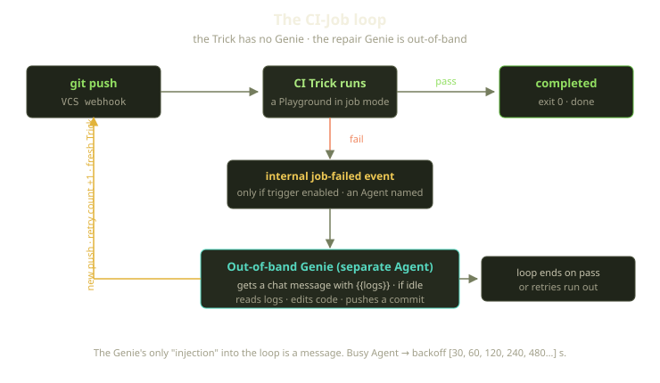
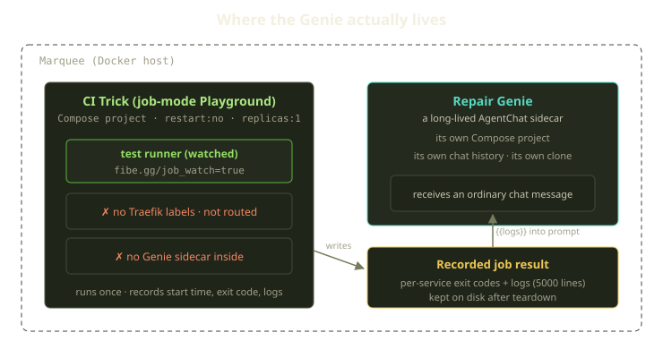
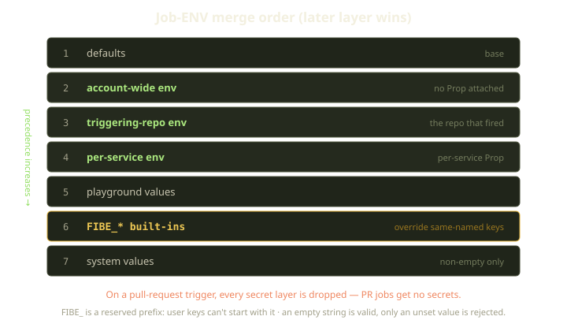

A Trick is the most boring primitive we have. It runs your container once, watches it finish, records the exit codes, and tears itself down. No routing, no Genie, no second act. So when someone proposed building "self-healing CI" on top of it, the obvious reaction was: with *what*? There's nobody home in a Trick.

That turned out to be the point. The Trick stays dumb; the intelligence lives elsewhere — a separate coding Genie that wakes up *after* the job is done, reads what went wrong, and tries to fix it. Compose a one-shot job with that out-of-band agent and you get a loop that runs your tests and, when they're red, takes a swing at making them green. We call the patterns **CI-Job** and **Muti-Job**, and the cleverness is never inside the Trick.

<!-- truncate -->



## First, what a Trick actually is

One fact everything here hangs on: there is no separate "Trick" thing in the system. A Trick *is* a Playground — the same primitive that backs an interactive environment — running in job mode. Same record, same lifecycle, same creation pipeline. What makes it a Trick is a single flag on the Playspec saying "this is a one-shot job," which tells the creation pipeline to skip two of its steps. Those two steps are the whole architecture:

1. **Routing is skipped.** A Trick gets no wildcard subdomain, no TLS cert, no way to open it in a browser. The Traefik wiring that hands an interactive environment a public URL never runs. It's a batch job, not a service.
2. **The Genie sidecar is skipped.** The load-bearing one: a job-mode Playground does **not** get a Genie attached. The interactive version comes up with a coding agent alongside the container; the Trick comes up bare.

Everything else — cloning the branch, authenticating to the registry, building the image, generating the Compose project — is the same code path an interactive environment runs. A Trick is not a new feature so much as the *absence* of two.

So when we say "a Genie fixes your failing CI," your first question should be: *which Genie?* Not one inside the Trick:



## The out-of-band Genie

The repair Genie is a completely separate thing: a long-lived **AgentChat**, its own Compose project on the Marquee, with its own clone of your repo and chat history. It exists before the Trick fails and isn't torn down with it.

When a Trick fails, the completion machinery publishes exactly one internal event — and only if the Playspec opted in by enabling its trigger and naming an Agent to notify. There's no event for a passing job, none for a failure on a Playspec that never asked for repair: a failed Trick stays quiet unless you've explicitly wired a Genie to it. That event is the *only* job-specific event in the system. The public webhook surface knows nothing about jobs, emitting the same `playground.*` events as everything else, because a Trick *is* a Playground — there are no `trick.*` or `job.*` webhooks to subscribe to.

The "fix" the event starts is smaller than you'd guess — no orchestration, no privileged channel into the Trick. We look up the Agent the Playspec named, confirm the asker is allowed to manage it, and check one thing first: is the Genie idle? If it is, we pull the logs from only the services that exited non-zero, splice them into your prompt template where you wrote `{{logs}}`, and send the whole thing to the Genie as an ordinary chat message — exactly as if you'd pasted the failure into chat yourself and said "fix this." That's the entire mechanism.

If the Genie is mid-thought, we back off and retry on a doubling schedule — seven attempts stretching to roughly eight minutes — rather than queue or interrupt; if it's still busy after all of them, we give up on *this* failure. Delivery is best-effort: one repair Genie per repo is fine, but point ten chatty Playspecs at a single Agent and some failures fall on the floor.

:::note
**No shared volume, no control socket — the Trick has already torn itself down by the time the Genie reads the logs.** What survives is the recorded job result: per-service exit codes and up to 5,000 log lines per service, deliberately kept on disk after the container is gone. Teardown removes the running Compose project but leaves that record — the only reason a Genie that wakes up later has anything to read.
:::

## Closing the loop

The Genie does what a coding agent does in a chat: it edits files in its own clone, figures out the fix, and pushes a commit. That push is a brand-new VCS event, landing right back at the top of the pipeline.

The part we find genuinely elegant: **there is no special "re-run" path.** The loop closes through the front door. A new push matches the same trigger Playspec, the platform re-checks that the trigger is enabled and that retries remain, and launches a *fresh* Trick — the same way the first one was launched. Each fresh Trick carries a count of how many times the loop has gone around, so the budget needs no special bookkeeping. Pass, and the loop ends: a zero exit code, nothing more. Fail again, and we go around once more with the count bumped, until the tests go green or it hits the ceiling you configured. That ceiling lives on the trigger config, so *you* decide how many times a Genie tries before a human has to look.

The loop is also *not* a Playguard concern. Playguard, our reconciler, heals interrupted creations and enforces lifetimes, but it deliberately skips Tricks. A failed test run isn't an infrastructure failure to retry into submission; it's a *result*, and you don't want your reconciler silently re-running a job whose whole purpose was to tell you something is broken. Recovery, if any, is the Genie's job, through a new push.

## Muti-Job: the same trick, pointed at mutations

Once you have "one-shot job plus out-of-band Genie," you can aim it at problems that aren't CI at all. The cleanest example we ship is **Muti-Job**, a mutation-testing loop.

Mutation testing flips small changes into your code (a `+` becomes a `-`, a boundary moves) and re-runs your tests. If they still pass, the mutant *survived* — that line isn't really covered, whatever your coverage percentage claims. Each survivor is recorded in one of three states: still surviving, killed by a freshly written test, or marked harmless because the mutant was equivalent. The loop drives every survivor out of that first state.

The plumbing is the same out-of-band pattern, with two deliberate differences. First, instead of `{{logs}}` the Genie's prompt gets `{{diff}}` — the mutation itself, so it knows exactly what change needs covering. We lock the survivor so two sweeps don't fight over it, fill the diff into your cure-prompt template, and hand it to the Genie through the same idle gate as CI repair.

Second — and this is the one to internalize — **Muti curing is unbounded.** A recurring sweep runs every five minutes and re-attempts *every* surviving, unlocked mutation; there is no retry ceiling. A survivor stays on the worklist until a Genie cures it, you mark it harmless, or you delete it. The per-survivor lock — stale after 10 minutes — only stops two sweeps from poking the same mutant at once; it isn't a retry budget. The asymmetry is intentional: CI is a gate that should converge fast or hand back to a human, so it caps retries; mutation curing is a backlog you grind down, so it keeps coming back until the survivor is gone. Same primitive, opposite stopping rule.

One correction we had to make in our own docs: there is **no enabled-by-default** for muti. It runs only when you explicitly turn it on in your Playspec config — declaring your project's language does *not* light it up. If you want it, you ask for it.

## Job-ENV: what the container actually sees

CI and mutation jobs run real code against real repos, which means secrets — and a chance to quietly leak a production token into a pull request. Job-ENV scoping prevents that, and its merge order has opinions baked in.



Env vars are layered, and later (narrower) layers win — exactly as you'd want a service-specific override to beat the repo-wide default. The full merge, pushed into our Rust core for determinism:

| Layer | Source | Notes |
|---|---|---|
| defaults | base | the floor |
| account-wide env | no Prop attached | applies everywhere |
| triggering-repo env | the Prop for the repo that fired | the triggering repo |
| per-service env | a service's own Prop | narrowest user scope |
| playground values | the Trick itself | |
| `FIBE_*` built-ins | injected | **override** same-named keys |
| system values | host | non-empty only |

Two rules fall out of this that you'll actually trip over:

**Secrets vanish on pull requests.** Inclusion comes down to a single check on the trigger event: everything except a pull request gets the secret layers; a pull request gets none. A PR job — which anyone who can open a PR can trigger — gets no secrets, full stop; push jobs from your own branches get the full set. It's the single most important rule in the resolver, and it really is just that one comparison.

**`FIBE_*` is reserved and always wins.** The platform injects a fixed set of built-ins — repo URL, owner, name, branch, commit SHA, trigger event, and the identifiers for the Prop, Playspec, and Playground involved — layered *after* your entries, so they override anything you named the same. You can't define your own `FIBE_`-prefixed keys; the validator rejects them. Inside any job you can rely on:

```bash
echo "$FIBE_REPOSITORY_OWNER/$FIBE_REPOSITORY_NAME @ $FIBE_COMMIT_SHA"
echo "triggered by: $FIBE_TRIGGER_EVENT"
```

## What we learned

The two patterns took maybe a tenth of the code we expected, and almost none of it was new. The lesson, boring in the best way: keep the primitive dumb, put the intelligence out-of-band, and let the stopping rules express intent — CI caps retries because it's a gate, Muti never caps because it's a backlog. The self-healing part isn't a feature we built; it's two dumb things talking through a message and a `git push`.
