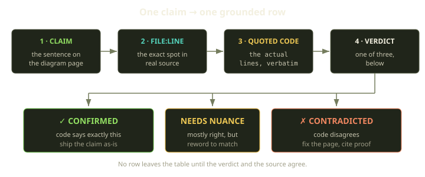
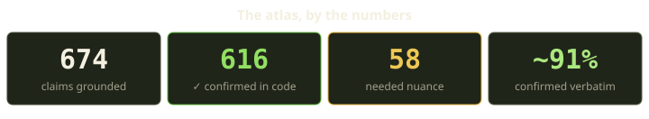
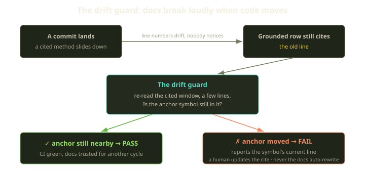

Every architecture doc we have ever read was true the day it was written. That's the trap. Code keeps moving, the doc stays still, and six months later you have a beautiful, internally consistent description of a system that no longer exists. Nobody lied — the doc just quietly drifted into fiction, and it still *reads* like the truth.

So when we set out to write the internal "Lifecycle Atlas" for Fibe — the diagram pages explaining how a Playground boots, how billing gates a Marquee, how the Playguard reconciler heals things — we made one rule up front: **a claim doesn't get to be on a page until it points at the line of code that makes it true.** Not a design doc. Not an Alloy model. The actual running source. This post is about what that rule cost, what it caught, and why docs should go through CI.

<!-- truncate -->

## Code does not lie (docs do)

The premise is almost insultingly simple: the source is the only thing guaranteed to be true, because it's the thing that runs. A doc is a *claim about* the source — "disabling a Prop stops your running Playgrounds" is a hypothesis: either a callback does that or it doesn't.

The mistake most doc efforts make is treating the existing docs as evidence. They're not — they're the suspect. So we refused to accept any prose document — another doc page, an Alloy model, a README — as proof: verifying the artifacts you distrust against themselves is circular. Evidence had to come from the things that actually run: the Ruby application code, the configuration it loads, the database migrations, and the Rust core. A claim supported only by an Alloy model was a flag to re-ground or correct, not a green check.

## The unit of truth is a row

We didn't review "the Playground page" — we reviewed every *claim* on it. Each claim becomes one row in a grounding table with four columns: the claim as written on the page, the supporting `file:line` in real source, the quoted code, and a verdict.

The verdict is one of three values, and the method lives or dies on keeping it to three:

- **Confirmed** — the code says exactly this. Ship it.
- **Needs nuance** — directionally right but sloppy. The unpaid-runtime quiesce is *tutorial-only*; the funding gate is roughly 103 call sites, not "about 80." Reword to match reality.
- **Contradicted** — the code disagrees. Fix the page; cite the proof it was wrong.

That third verdict earns its keep. "Confirmed" feels good and changes nothing; "Contradicted" is where the doc was lying, with a paper trail of the lie and its fix. A grounding file isn't done when every row is green — it's done when page and source *agree*, which sometimes means the page changed.

## Be adversarial on purpose

Here's the part that's easy to skip. If you read a doc and go looking for the code that confirms it, you will find it — confirmation bias is the default mode of anyone verifying their own team's work, so a method *near* the behavior becomes "confirmed." So we inverted it. Each resource got an independent pass whose instruction wasn't "confirm these claims" but **actively try to find claims the code contradicts.** Open the cited code, then hunt for the early return, the guard clause, the code path the page forgot.

Adversarial reading turned up real bugs in our docs. A few we still think about:

- The AgentChat page cited five symbols — names for "control-plane view permitted," "Marquee declared unavailable," "no route reachable," "host destroyed," "purge succeeded" — as if you could grep for them. They aren't application code; they're *Alloy model names*. The behaviors were real, but the page pointed at the model's vocabulary instead of the code's. We re-cited the actual methods that promote a reachable chat, quiesce chats when a Marquee goes unavailable, and tear an environment down completely.
- The same page said a Genie ran a "headless browser." The code disables the browser entirely. "Headless" and "disabled" are not the same word, and a reader building on the distinction would be wrong.
- The Playground page claimed all three stale-recovery paths require "no active remote-compose." Contradicted: they gate on whether the creation job and the Sidekiq worker are still active — a different condition, not a nuance.

## What the numbers looked like

When the dust settled, the atlas had **674 grounded claims** across twelve resources: **616 confirmed in code**, 58 needing nuance, zero contradictions outstanding — every red correction chased to a `file:line` that proved it, then fixed. Roughly **91% were confirmed verbatim**, including every load-bearing constant: timeouts, TTLs, poll counts, daily budgets, the 402 payment-required gate an unfunded Marquee returns, the Wallet and ledger invariants, the rule that a grace period never extends the paid-through time.

| Resource | Claims | Confirmed | Needs nuance |
|---|---:|---:|---:|
| AgentChat | 90 | 73 | 17 |
| Playground | 92 | 79 | 13 |
| Marquee + Billing | 82 | 75 | 7 |
| Tricks | 81 | 76 | 5 |
| Runtime & filesystem | 67 | 56 | 11 |
| Cascades & shutdown | 57 | 57 | 0 |
| Convergence & self-healing | 54 | 50 | 4 |
| Playguard | 40 | 39 | 1 |
| Contracts (SDK + browser) | 29 | 29 | 0 |
| Props & Git providers | 27 | 27 | 0 |
| Other | 55 | 55 | 0 |
| **Total** | **674** | **616** | **58** |

The 9% that *wasn't* verbatim is the entire point. A grounding pass that finds nothing isn't reassuring — it means either the docs were already perfect or the reviewers weren't trying, and it's almost never the former.

The negative claims took the most work, which we didn't expect. A surprising amount of an architecture doc is statements about what *doesn't* happen — disabling a Prop does not stop your running Playgrounds; a Secret Vault change does not redeploy a running Genie. You can't quote a line that does the thing, because there is no line. So you ground the absence: confirm there's no cascade, no callback, and no subscriber wired up, and cite the search that returns nothing against the file where the edge would sit if it existed.

## Then the code moved

You ground 674 claims, you feel great, and three weeks later ten commits land in the codebase and your grounding file is full of references where the *file* is right but the *line* has slid by four. Behavior intact, citation stale — and a stale citation is a tiny lie that sends the next reader somewhere wrong.

We re-audited the whole atlas against the latest code after that batch: **zero behavioral contradictions** — every load-bearing constant and confirmed divergence re-verified intact. But the line numbers had moved. The Playguard cycle got reordered — the entitlement check now runs first, and the launchability check slid a few lines down — same outcome, every citation now needing re-anchoring. Doing that by hand, across hundreds of rows, every time someone touches the codebase, is the kind of toil that quietly stops happening. So we wrote a checker.

## The drift guard: a checker that re-verifies the cite

There are two checks, and they're not the same strength. The weaker one — which we already had — proves the cited file and line *exist*: file there, line in range. Cheap, and blind to a line that now points at the wrong code.

The stronger check is symbol-anchored. When a grounded row quotes a named thing in the source — a method, or a named constant like a timeout — that name is the *anchor*. The drift guard re-reads the cited range (a window of a few lines on either side) and asks: **is the anchor still there?** If so, the citation is good even if surrounding code shuffled. If not, the checker doesn't guess — it fails the build and tells you exactly where the symbol went: which grounding row points at which now-stale citation, and the line where the anchor actually lives today. That single line of output is enough to re-anchor the row in seconds.

The checker walks every grounding-table row, parses the `file:line` references and the backticked spans, resolves each path across the workspace's repositories, and checks each anchor against the live window. Two design decisions we'd defend:

- **It reports, it doesn't rewrite.** On drift, the checker prints the candidate line and stops — it never silently edits a doc to match the code. Auto-rewriting gets you docs that are *syntactically* in sync and *semantically* meaningless. A failed build instead forces someone to decide whether the *sentence* is still true, not just the line number.
- **Explicit anchors are strict; inferred ones are advisory.** When a row carries an explicit hint naming the symbol to track, that anchor is checked hard — drift fails the build. Symbols *inferred* from the backticked code are noisier (a multi-reference row often quotes one file while citing another), so they run only in advisory mode on single-reference rows. False positives erode trust faster than anything; the advisory lane keeps the strict lane clean.

## Docs are code, so review them like code

The whole thing is one idea applied stubbornly: **documentation deserves the same machinery we already trust for code.** We don't ship a Rails change on the author's confidence — we demand a test, a reviewed diff, green CI. Yet the same engineers will assert a subtle distributed-systems behavior in prose and ship it on vibes — even though a wrong doc can cost more than a wrong line, because the line gets caught by a test and the doc gets *believed*. Grounding closes the gap: a claim is now testable, reviewed, and CI-checked, exactly like the code it describes.

The payoff isn't a one-time clean audit — it's that the docs now have a *failure mode*. A doc used to stay wrong indefinitely, with no signal but a confused engineer three months later; now, when the code moves out from under a claim, the build turns red.

None of this makes documentation effortless — it makes it *honest*, and makes dishonesty loud instead of quiet. The next time someone follows a citation from a Fibe atlas page into the source, the code will say exactly what the page promised. That is the whole game.
