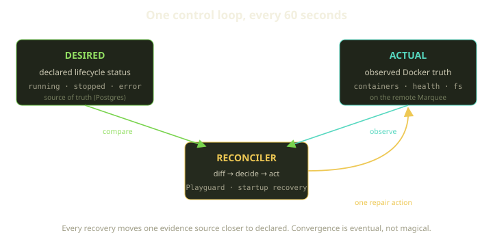
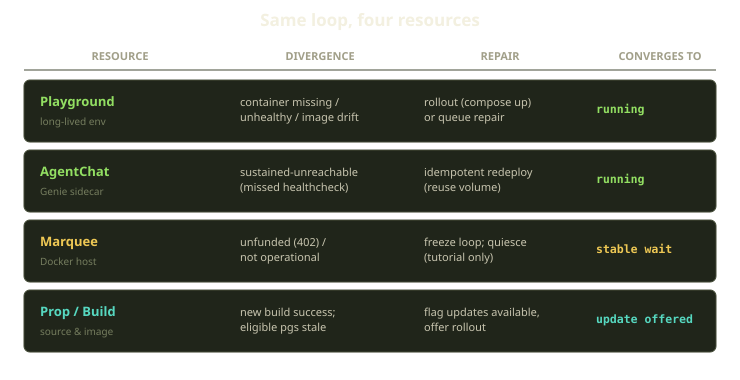
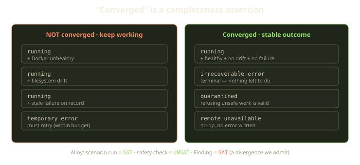
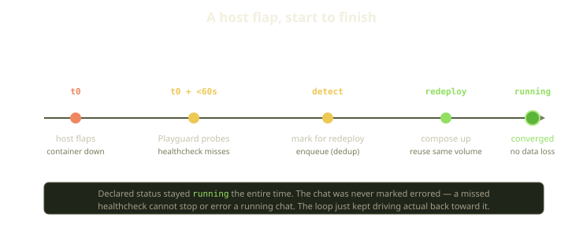
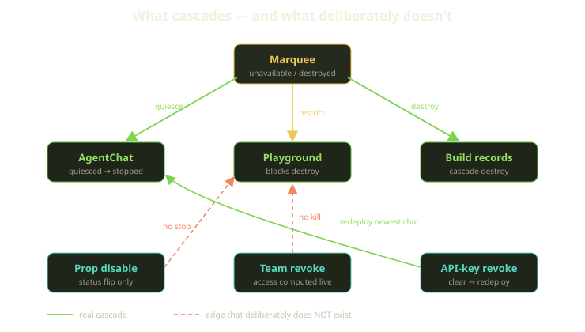

Here is the uncomfortable truth at the heart of any platform that runs other people's code on machines it doesn't fully own: the moment after you deploy something, it starts to be wrong. A container OOMs. A host reboots. A VM's clock skews. Someone pushes a new image. The network blips for ninety seconds and a healthcheck misses. None of this is exotic — it's Tuesday. The interesting question isn't *whether* reality will drift from what you asked for. It's what your system does in the gap.

Fibe's answer is the oldest good idea in operations, applied uniformly: you **declare** what you want, and a control loop **drives** the world back toward it. You say "this Playground should be running." Somewhere a reconciler wakes up every sixty seconds, looks at the actual Docker truth on your Marquee, notices it disagrees, and does exactly one thing to close the gap. Then it goes back to sleep. The state you typed is the source of truth; everything the containers are actually doing is just *evidence*.

<!-- truncate -->

That sounds clean on a whiteboard. This post is about what it looks like when it meets a real fleet — the per-resource self-healing, the eventual-consistency mechanics that keep it from eating your data, the formal models we use to keep ourselves honest, and the handful of places where the live code is not yet as ideal as the model says it should be. We document those too. A reliability story that only tells you about the parts that work is marketing.

## Declarative, not imperative

The distinction is worth being pedantic about, because it shapes everything downstream.

An imperative system records actions: "start the container." If that action fails halfway, or succeeds and then the container dies an hour later, the system has no opinion — it already did its job. A declarative system records *intent*: "this should be running." Intent doesn't expire. As long as the declared status says `running` and the container isn't, the system is, by definition, not finished.

On Fibe the declared status lives in Postgres, on the resource record itself. The Alloy model that formalizes Playground convergence states it plainly:

> User-facing states remain the source of truth for intended behavior.

Runtime — what `docker ps` says, whether the healthcheck passes, whether the filesystem matches what the build produced — is evidence, weighed against that intent. When they disagree, intent wins and the loop acts. We hold one rule above almost everything else, and it's also lifted straight from the model:

> Convergence is eventual, not magical — every recovery moves one evidence source closer to declared.

"One evidence source." Not "the reconciler fixes everything in one pass." A single tick might re-pull an image, or clear a stale error, or queue a redeploy — one motion toward the declared state. Idempotency makes the next tick safe to run regardless of how the last one ended. This is the difference between a system that *converges* and a system that *thrashes*.

## The reconcilers

Two scheduled jobs do the bulk of the work, and they run on a deliberately boring cadence: each fires once every sixty seconds, on its own timer, with no fancy event triggers to miss. A fixed, frequent tick is the whole point — a loop you can set your watch by is a loop you can reason about, and a missed cycle is never more than a minute from being corrected on the next one.

**Playguard** is the steady-state reconciler. Once a minute, per Marquee, it walks every Playground, AgentChat, and the host itself, compares declared intent against observed Docker truth, and emits repairs. The second loop, the **startup-recovery** reconciler, handles the narrower problem of work that was *in flight* when a worker died — a creation job that got halfway and then the process vanished. Both are pure convergence loops. Neither cares how the divergence happened; they only care that it exists and that intent says otherwise.

The same loop shape covers four very different resources. Here's the matrix.

Let's walk each one, because the differences are where the design actually lives.

### Playground: Docker is the witness, not the boss

A Playground is a long-lived environment — a Docker Compose project on your Marquee. Its declared status is *running*. Every cycle, Playguard checks whether the containers are present, healthy, and built from the image the current build produced. If a container is missing, unhealthy, or the image has drifted, it rolls out (a `compose up`) or queues a repair. The formal model spells out that behavior as a named safety property: when the live filesystem has drifted from what's declared, the loop must either repair it or queue a repair — never shrug and move on.

The subtle part is the inverse direction. Docker truth doesn't only *trigger* repairs — it can also *clear false alarms*. Suppose a transient SSH hiccup once wrote an error onto a Playground that is, in fact, running fine. On the next sync, Playguard reads the live Docker state, sees a clean running project, and clears the stale error — promoting the record back to running. That recovery path is also a named property of the model: live Docker recovery converges back to running and clears the stale failure.

The code that does it deliberately bypasses the usual record validations to write the observed runtime state directly. This is one of the rare places where skipping validation is the *correct* call: the runtime snapshot is denormalized evidence cached onto the record, not user intent, so it's written straight through whenever the observed state differs from what's stored, and a change event is published so the rest of the system sees the corrected state. Writing it through the full lifecycle machinery would be the wrong shape — you're recording what Docker *is*, not asking permission to change what the user *wants*.

So evidence cuts both ways: it can demote a record that lied about being healthy, and it can rehabilitate one that was wrongly marked failed. Both are the same principle — drive toward the truth, and don't trust a stale failure flag over a container that is visibly serving traffic.

One guard matters here. The reconciler will **not** repair a Playground that has creation work actively in progress — touching a half-built environment is how you turn one problem into two — and it will **not** recreate based on an *unknown* host-artifact probe. If it can't tell what's actually on the host, it defers rather than guess. When you're holding a hammer that can recreate environments, the most important thing you can teach it is when to keep its hands in its pockets.

### AgentChat: a missed healthcheck is not an error

AgentChats are the Genie coding agents — AI sidecars deployed as their own Compose projects. They get the most forgiving reconciliation in the system, and the reasoning is human: a chat you're actively talking to should not get yanked out from under you because one healthcheck timed out.

So the rule is firm: **a missed healthcheck can never stop or error a running chat.** A single miss is noise. What earns a response is *sustained* unreachability — and even then the response isn't a terminal state, it's an idempotent redeploy.

The reconciliation for a running chat reads like a short decision tree. It only acts once recovery is actually due — there's a cooldown so a single blip doesn't trigger anything. When it does run, it probes the chat. If the probe comes back healthy, it clears any pending recovery and stops. If the chat is genuinely unreachable, it marks the chat for redeploy and enqueues a start. And there's a third branch that matters more than it looks: if the probe *times out* — meaning the whole host is unreachable, not the chat — it writes nothing and returns.

That timeout branch is the interesting one. If the *whole Marquee* is unreachable — not the chat, the host — we don't write an error at all. There's no information in "I couldn't reach the host," so recording a failure would just be manufacturing a false negative for the next loop to clean up. We return and try again next minute. The model captures this as a hard rule: a remote-unavailable result is a no-op that writes no error.

The redeploy reuses the same Compose project and the same named data volume, so a Genie that flaps comes back with its working tree intact. And there's a self-heal in the other direction too: an *errored* chat that becomes reachable again gets promoted straight back to running. Which brings us to a candid nuance.

:::note A divergence we'll own
That promotion is written directly inside the reconciler, rather than going through the declared lifecycle state machine that every other transition uses. It's correct in behavior and covered by tests, but it's a transition performed *outside* the canonical lifecycle. We flag it honestly: convergence code that writes status directly is convergence code you have to reason about twice. It's on the list to route through the lifecycle like everything else.
:::

There's also a guard worth calling out for what it *doesn't* do: orphan cleanup, which reaps Compose projects with no database record, **never mutates a live visible chat.** Reapers are dangerous precisely because they delete things; the only safe reaper is one that is structurally incapable of touching something real.

### Marquee: convergence includes knowing when to freeze

The Marquee is the Docker host. Its reconciliation is different in kind, because the failure modes are different: a Marquee can be *unfunded*, not just unhealthy. And those demand opposite responses.

If a Marquee isn't funded, Playguard doesn't try to heal anything — it freezes. Before it does any work at all, the loop checks three things up front and bails if any fails: the host must be active, it must be allowed to launch chats, and its runtime must be funded for this kind of operation. Miss any one of those and the entire cycle short-circuits before a single repair is attempted. The funding gate in particular returns a payment-required signal — an HTTP `402` — rather than an error, because "not funded" is a deliberate state, not a fault.

This is the convergence principle showing its teeth. An unfunded host has *declared* that it shouldn't be spending resources. Reconciling it back to "everything running" would directly violate intent. So the stable, converged outcome for an unfunded Marquee is: do nothing, wait. Freezing is a valid terminal state of the loop, not a failure of it.

When a Marquee genuinely goes unavailable, it quiesces its open chats — marks them stopped, keeps the record, preserves the volume — but only under a careful guard: it must be non-operational, have live chats, **and have no chat that is still answering its healthcheck.** A chat that's still reachable is, by definition, not down, no matter what the host status says. The model enforces this directly: a false host-failure signal can never hide a chat that is visibly alive. We refuse to let a host-level signal override per-chat evidence.

### Prop and Build: drift you *offer* to fix, not force

Source and image drift is the one place where convergence is intentionally *not* automatic, and the restraint is the feature.

When a new build of your source succeeds, the platform marks eligible running Playgrounds with an "updates available" flag — a signal that says "newer source exists, want to roll it out?" It does **not** silently redeploy your environments under you. And it's picky about eligibility: dirty Playgrounds (ones with uncommitted local changes), Tricks running in job mode, and production Playgrounds are **never** auto-marked. The convergence target here is a *notification*, not a *mutation*. Driving someone's running environment to a new image without consent isn't self-healing — it's self-harm with extra steps.

There's a discipline on the build side that's easy to overlook: a rebuild pins the *exact* source identity plus the Docker shape that produced it, so two builds are only ever treated as "the same" when both the source and the way it was built match. And stale-build recovery only ever fails builds that are genuinely stuck mid-build — it won't touch one that already reached a terminal state. The convergence rule for images is the same as for everything else: act on the thing that's genuinely incomplete, leave the settled ones alone.

### Tricks: convergence with a deadline

A Trick is a headless, one-shot Playground — job mode. It runs to completion and then it's done, which makes its convergence story different from a long-lived environment. There's no "should be running forever" intent to maintain; there's a job that must reach a terminal verdict, and the loop's job is to *guarantee a terminal verdict even when things go wrong.*

A dedicated completion loop polls the running job every 10 seconds, up to a hard ceiling of 1,440 polls — which works out to roughly four hours. Each poll asks the same question: has the job finished? If it has, the loop records the verdict and stops. If the poll count crosses the ceiling without a finish, the loop forces a terminal outcome itself rather than letting the job poll forever.

Hit the ceiling and the Trick converges to a *visible, structured* error — a clear "job timed out" verdict — never a record stuck in limbo claiming to run forever. A detached job whose Compose startup failed becomes a visible error too, never a silent stale-running row. The timed-out teardown keeps both the record and the job's result, because the *evidence of what happened* is the whole point of a job — you want to see why it timed out, not have the corpse swept away.

Two honest quirks live in here. First, job completion has no funding re-check inside its poll loop — once a Trick is running, a mid-job funding lapse won't kill it; it polls to its deadline. That's deliberate: yanking a half-finished job for a billing edge would lose work and produce a confusing partial result. Second, overlap is prevented not by the 60-second reconciler but by explicit leases — a 660-second execution lease and a 30-second enqueue lock — so two workers can't both decide to finish the same job. Same convergence philosophy, different timer.

## What "converged" actually means

If you only remember one idea from this post, make it this one: **"converged" is not "running." It's a completeness assertion.**

A Playground that is `running` while its Docker is unhealthy is *not converged* — there's still a gap, so the loop must keep working. The same is true for `running` with filesystem drift, or `running` carrying a stale failure flag. Each of those is a known-incomplete state, and we wrote it down as a formal safety property.

| Situation | Converged? | Why |
|---|---|---|
| `running` + healthy Docker + no drift + no failure | yes | nothing left to do |
| `running` + unhealthy Docker | **no** | gap exists, keep reconciling |
| `running` + filesystem drift | **no** | image/source mismatch, repair or queue |
| `running` + stale failure on record | **no** | evidence contradicts the flag, clear it |
| temporary error | **no** | must retry (within budget) |
| irrecoverable error | yes | terminal — nothing more to attempt |
| quarantined by Playguard | yes | refusing unsafe work is a valid outcome |
| remote unavailable | yes (this tick) | no-op, no error written, retry next loop |

Two of those rows are counterintuitive and both are deliberate.

An **irrecoverable error is converged.** That feels wrong until you internalize that convergence means "the gap is closed," and for a terminal failure there is no gap left to close — the declared and actual states agree that this thing is dead. The loop's job is done. The opposite mistake, retrying a permanently-broken thing forever, is how you build a system that burns a host to the ground trying to resurrect a corpse.

**Quarantine is converged.** From the model:

> Playguard is part of convergence because refusing unsafe work is a valid stable outcome.

A reconciler that can *decline* is far more valuable than one that always acts. Half of reliability is restraint.

There's a real subtlety lurking under "irrecoverable," though. The system can't always tell a temporary failure from a permanent one — sometimes all it has is an opaque, free-text error string left over from an older code path. The contract handles this explicitly: opaque failures must be **classified before they're repaired.** A dedicated classifier turns that raw prose into a structured verdict — temporary or permanent — and only then does a convergence rule get to act on it. You don't get to decide "retry vs. give up" on a vibe. You classify first, then the right convergence rule applies.

## Eventual consistency without eating your data

Convergence loops have a famous failure mode: they retry, the retry partially succeeds, they retry again, and somewhere in there they double-create a thing or clobber state. The defenses are unglamorous and load-bearing.

**Idempotent everything.** The SDK carries an `Idempotency-Key` so a retried request replays instead of duplicating. Async operations return `202` and you poll to a terminal state rather than blocking. Job enqueues dedup themselves — a reconciler that fires twice in the same window won't enqueue a second copy if one is already active or already queued, so it only does the work once. And marking a job complete is idempotent at the database level, backed by a unique index plus a rescue, so two workers racing to mark the same job done produce one row, not an exception and a half-written state.

**No data loss on a host flap.** When a container dies and comes back, the redeploy reuses the existing named volume. Stop is a `down` *without* `-v`; only a clean expiry or an explicit purge removes volumes. A flapping host costs you a few seconds of reachability, not your working tree. Here's that flap end to end.

The thing we want you to notice in that timeline: the declared status stayed `running` the whole way through. The chat was never marked errored. The loop didn't need to mutate intent to fix reality — it just kept nudging reality back.

**Bounded recovery budgets.** This is the part people forget, and it's the difference between self-healing and a self-inflicted DoS. An unbounded reconciler that hits a genuinely broken environment will retry it into the ground, monopolize the host, and starve every healthy neighbor. So every repair path is metered, and the numbers are deliberately conservative:

- At most **three** concurrent recreations per host, so one sick environment can't crowd out the rest.
- A **ten-minute** cooldown between auto-rollouts, so a flapping resource can't trigger a redeploy storm.
- At most **two** container-conflict recoveries per hour, after which the loop stops trying that particular fix and leaves the situation visible instead of churning.
- A **ten-minute** repair lease, so two reconcilers can never decide to fix the same resource at the same time.

The loop is allowed to be persistent, but not frantic. Stale in-progress work gets a similar treatment: the startup-recovery loop resets it back to pending after a short grace, and Playguard backstops with a thirty-minute staleness timeout — but **only if no live worker still owns it.** Reset a record whose worker is merely slow and you've created the double-execution you were trying to prevent.

:::tip Fairness is a feature
Running every 60 seconds, capped at 3 concurrent recreations, with per-resource leases, is what lets one sick Playground fail quietly in the corner while its forty healthy neighbors keep humming. An unbounded healer is just a faster way to take down a whole host.
:::

## The edges that deliberately don't exist

Some of the best reliability decisions are arrows we chose *not* to draw. A surprising amount of operator pain comes from cascades nobody intended — a config change that, three hops later, kills a running workload. So we audited the interaction graph for edges that *shouldn't* exist and confirmed, in code, that they don't.

The real cascades are the ones you'd expect and want:

| Edge | Behavior |
|---|---|
| Marquee unavailable &#8594; AgentChats | quiesce to stopped, record + volume kept |
| Marquee destroyed &#8594; AgentChats / Build records | cascade destroy — the children go with the parent |
| Marquee &#8594; Playgrounds | destroy is *blocked* while Playgrounds still exist |
| API key revoked &#8594; running chat | clear runtime key, redeploy |

And here are the edges that, by design, are **absent** — each verified by confirming, in code, that the cascade simply isn't wired up:

- **Disabling a Prop does not stop running Playgrounds, builds, or CI.** A Prop disable is a pure status flip with no downstream cascade hanging off the update. Your environments keep running on the source they already have. Disable means "don't start new work from this," not "kill everything downstream."
- **A team-role change does not kill a live session.** There's no destroy cascade on team membership; access is computed *live, per request* by joining the user against what they're allowed to see. Revoke someone and they lose access on their next request — they don't get torn out of a running session mid-keystroke.
- **An API-key scope or rate-limit change does not redeploy anything.** Only key *invalidation* — deleting it, letting it expire, or turning off agent access — clears runtime keys; a scope tweak just applies on the next request.
- **A Secret Vault change does not redeploy a Genie.** Secrets are auditable and webhookable, but carry no redeploy subscriber. New secret values apply when a chat next launches, not by force-restarting your agent.

The unifying principle: **configuration changes shape future work; they don't reach in and kill present work.** The blast radius of "I changed a setting" should be the next operation, not the one you're in the middle of. Every one of those absent edges is a 3am page that never happens.

## Keeping ourselves honest with Alloy

Every property in this post is backed by an executable formal model. The convergence contracts live in a set of Alloy specs kept alongside the rest of the engineering docs, and the suite runs three kinds of command:

- **Scenario `run`** commands assert a desired behavior is *reachable* — they should be `SAT`. (A host flap *can* recover to running.)
- **Safety `check` commands** assert a bad state is *impossible* — they should be `UNSAT`. (You can never reach "missed healthcheck stopped a running chat.")
- **`Finding` commands** are the honest ones. They're written to be **`SAT` on purpose** — they demonstrate that the *current code* can reach a state the normative model forbids. A `Finding` that comes back SAT is a divergence we've witnessed and are choosing to document rather than hide.

That last category is the soul of this whole effort, so let us name real ones rather than wave at them. The models currently surface, among others:

- **A temporary error can remain stuck.** One Finding shows a Playground that hit a temporary failure but, under a specific in-flight-creation race, doesn't reach a repair queue or running on the next step. The ideal model says every temporary error reaches a repair queue or running; the live code has a window where it doesn't.
- **Runtime can launch while unpaid.** Another Finding demonstrates a path where a runtime operation slips past the funding gate. The payment-required `402` on an unfunded host is supposed to be universal; the model found a seam.
- **Build-success and source-drift bypasses.** A couple of Findings in the Prop/Build models show ways a build can be marked successful, or source drift hidden, outside the canonical identity-pinning path.

None of these are catastrophes. They're the gap between the system as modeled and the system as built — and the entire point of writing the model down is to *measure* that gap instead of pretending it's zero. The `Finding` runs double as a prioritized backlog: the highest-severity, currently-unenforced items are exactly the next things we go fix. When we close one, its `Finding` command flips from SAT to UNSAT, and that flip is the regression test.

This is also why we're comfortable being so blunt in a public post. "Self-healing by design" doesn't mean "no bugs." It means the failure model is explicit, the recovery is bounded, the cascades are audited, and the divergences are *named and tracked* rather than discovered at 3am. A system you can describe honestly is a system you can actually trust.

## What we learned

A few things have held up across every resource and every incident review:

1. **Declare intent, reconcile toward it.** Recording desired state instead of actions is what turns "the deploy failed" into "the loop will keep trying." Intent doesn't expire; actions do.
2. **Make repairs idempotent and the loop is free to be dumb.** If every repair is safe to run twice, you stop needing the reconciler to be clever about what already happened. Cheap, repeatable, frequent beats smart and fragile.
3. **"Converged" is completeness, not "running."** Define done as "every evidence source agrees with intent," and terminal failures and quarantines become legitimate stable outcomes instead of states you forgot to handle.
4. **Bound the budget or build a DoS.** Cooldowns, concurrency caps, and leases are what separate self-healing from a host-killing retry storm. The restraint is the engineering.
5. **The arrows you don't draw matter as much as the ones you do.** Config changes shape future work; they don't kill present work. Audit your cascade graph for edges that shouldn't exist — and prove their absence in code.
6. **Model it, then count the gap.** Formal models earn their keep not by proving you're perfect but by turning "we think this can't happen" into a `check` that's UNSAT — and turning the things that *can* happen into Findings you've named, prioritized, and can watch flip green.

Convergence is eventual, not magical. Every minute, on every Marquee, the loop wakes up, looks at the gap between what you asked for and what's actually running, and takes one honest step to close it. That's the whole trick. The hard part was deciding, precisely and in writing, what "closed" means.
