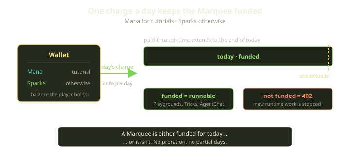
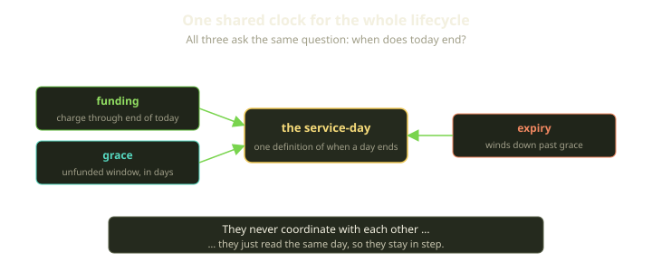
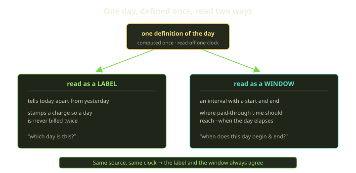

Billing at Fibe runs on a unit we call the **service-day**. A Marquee is either funded for today or it isn't. Every day, for every funded environment, a small charge is taken from the player's Wallet and the Marquee's paid-through time is pushed to the end of the current day. There is no monthly subscription to reason about, no proration math, no surprise cliff at the end of a cycle — just one question, asked once a day, forever: *did you pay for today?*

This post is about why we chose that shape, how the daily charge keeps an environment running, and the single design rule underneath it that keeps every part of the billing lifecycle agreeing on what "today" actually means.

<!-- truncate -->

## What a service-day is

A service-day is exactly what it sounds like: one calendar day of runtime for one Marquee. It is the smallest thing we charge for, and we never charge for a fraction of one.

That last part is deliberate. We could meter runtime by the second — count the milliseconds a container was alive, multiply by a rate, bill the remainder. Plenty of clouds do. But per-second metering buys precision the player never asked for and pays for it in legibility. A bill becomes a derivative of uptime you can't predict in advance, can't sanity-check at a glance, and can't reason about without a calculator. "You used 19 hours, 42 minutes, and 8 seconds across three Playgrounds" is *accurate* and almost useless.

Whole days are the opposite trade. The price of running a Marquee for a day is a flat, known number. You can look at your Wallet and your environments and know — without arithmetic — how many more days you can run. Funding is a yes/no fact about today, not a slowly-draining meter. When you ask whether you can run a Trick right now, the honest answer is binary, and a service-day lets the system give you the binary answer directly: this Marquee is funded for today, or it is not.

So we round *up* to the day and make the day the atom. A Marquee that ran for ten minutes and a Marquee that ran for ten hours both consumed one service-day. That feels almost wasteful until you notice what it removes: every conversation about partial usage, every dispute about exactly when the clock started, every edge case where a crash at 11:58pm costs two minutes of the next day. The unit is coarse on purpose, because coarse is predictable, and predictable is what a player actually wants from a bill.

## How daily funding works

Funding is the mechanism that turns "you owe for today" into "you're running today." It is a single, repeating transaction.

Once a day, for each Marquee that should be running, we take the day's charge from the player's Wallet and extend that Marquee's paid-through time to the **end of the current service-day**. The currency depends on the context: a tutorial environment spends **Mana**, the allowance we hand new players so they can learn the platform without touching real value; everything else spends **Sparks**, the platform's real billing currency. Either way the move is the same — a small debit, a paid-through time that now reaches the end of today.

"Funded" is the whole point of the transaction, because funded means **runnable**. A Marquee whose paid-through time covers today is allowed to do runtime work — start Playgrounds, run Tricks, drive an AgentChat session. A Marquee that hasn't been funded for today is not, and the platform enforces that directly: the work doesn't quietly degrade or run-and-bill-later, it stops at the gate with a clear, dedicated *not funded* response — the same **402** you'd expect anywhere money is the missing ingredient. The status code is doing exactly its job: this isn't an error, a bug, or a permission problem. It's "this would cost a service-day, and today's service-day hasn't been paid for."

That gate is deliberately the *only* thing standing between an unfunded environment and new runtime. We don't sprinkle balance checks through the product. One place asks "is this Marquee funded for today?", and everything that costs a service-day routes through it. Funding extends paid-through time; the gate reads paid-through time; nothing else needs to know how billing works.

## One clock for the whole lifecycle

Funding is not the only part of billing that cares about days. Two others do, and they have to agree with funding and with each other.

The first is **grace**. When a Wallet can't cover a day, we don't slam the environment shut on the stroke of midnight. There's a grace window — a stretch of time where the Marquee keeps running unfunded while the player tops up — and grace is measured in days, because everything here is. The second is **expiry**: an environment that stays unfunded past its grace eventually winds down, and "past its grace" is, again, a question about which day it is now versus which day the grace ran out.

Funding, grace, and expiry are three different subsystems asking the same underlying question — *what day is it, and when does that day end?* — and the entire model only holds together if they get the **same answer**. If funding thinks today ends at one moment and the grace clock thinks it ends at another, you get a Marquee that's been charged for a day it's no longer considered to be in, or a grace window that lapses an hour early, or an expiry that fires while the environment is technically still paid. None of those are exotic; they're the natural result of two parts of one system keeping two private notions of "the day."

So the day boundary is not a detail any one of these subsystems owns. It's a **shared clock**. Funding keys off the service-day. Grace keys off the service-day. Expiry keys off the service-day. They are not coordinating with each other — they're all reading the same definition of when a day begins and ends, which is what lets them stay coordinated without trying to.

## Define "a day" exactly once

Underneath all of this is one rule we hold firmly, because it's the rule that makes the shared clock actually shared: **define "a day" exactly once, and use that single definition everywhere.**

This sounds too obvious to state. It is not. "What day is it?" is one of those questions that looks trivial and turns out to be quietly treacherous in any billing system, because a date is really two different ideas wearing the same word.

There's the day as a **label** — the thing that tells today apart from yesterday, that stamps a charge so we never accidentally bill the same day twice, that names which day a grace incident belongs to. And there's the day as a **window** — an interval on the timeline with a start and an end, the thing that decides when paid-through time should reach and when a day has actually elapsed.

In a world with a single, fixed clock those two ideas collapse into one and you can be careless about which you mean. The trap is computing the label on one clock and the window on another — for instance, deriving the label from UTC while reading the start and end of the day in the deployment's local time zone. As long as local time *is* UTC, the two agree and everything looks fine. Shift the local zone east or west and they describe different spans of real time, and the disagreement concentrates exactly where you'd least want it: in a thin band around midnight, where the label has rolled to a new day but the window hasn't, or vice versa.

That midnight band is the canonical home of the off-by-one — the charge attributed to the wrong day, the grace window that lapses an hour early, the paid-through time set to a boundary that has already passed. It is not a bug we are recounting; it's a seam we design *against*. The reason we hold the one-definition rule so strictly is precisely that this class of mismatch is invisible to ordinary review: each piece looks correct on its own, and the defect only lives in the gap between two notions of a day that were never reconciled. Remove the second notion and the gap can't exist.

So we don't let "a day" mean two things. One authoritative definition of the service-day — when it starts, when it ends, what to call it — is computed in one place and consumed everywhere: by the funding charge, by the grace clock, by expiry. Which clock that definition uses matters less than the fact that there is only one of it. For a global billing system, UTC is the saner anchor — it's stable, it has no daylight-saving discontinuities, and it's an internal accounting unit no human reads off a wall clock — but the property that actually keeps the system honest isn't the choice of zone. It's that the label and the window are always read from the *same* zone, so they can never disagree about which span of real time "today" is.

## Rules of thumb

If you're building anything that bills by the day, a few things we'd carry forward:

- **Pick a coarse unit on purpose.** Whole days beat per-second metering not because they're more accurate — they're less — but because a flat daily price is something a player can predict, verify, and plan around. Legibility is a feature.
- **Make funding a binary fact, not a meter.** "Funded for today" is a yes/no the whole product can branch on. Route every runtime cost through one gate that reads it, and let an unfunded request fail loudly and immediately with a **402** rather than running now and reconciling later.
- **Give the lifecycle one clock.** Funding, grace, and expiry all turn on "what day is it?" — so they must all ask the same source. Don't let any subsystem keep a private notion of when a day ends.
- **Define "a day" exactly once.** A date is both a label and a window, and the seam between those two readings is where midnight off-by-ones are born. One authoritative definition, computed once, consumed everywhere — and read the label and the window off the same clock so they always describe the same span of time.

A service-day is a small idea. But getting it right is mostly about discipline at one point: deciding, once, what a day *is*, and then refusing to ever decide it again.
